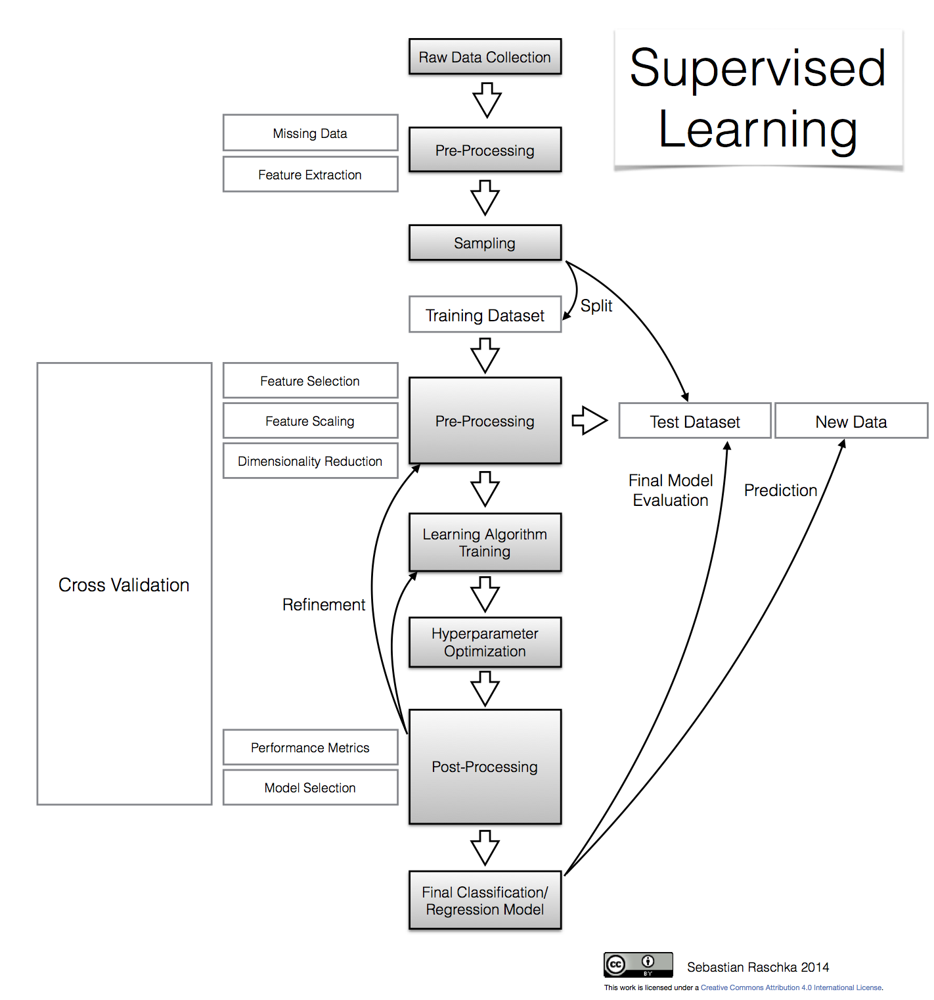

**Tutorials, examples, collections, and everything else that falls into the categories: pattern classification, machine learning, and data mining.**
 
 

 
 

# Sections

- [Introduction to Machine Learning and Pattern Classification](#introduction-to-machine-learning-and-pattern-classification)
- [Pre-Processing](#pre-processing)
- [Model Evaluation](#model-evaluation)
- [Parameter Estimation](#parameter-estimation)
- [Statistical Pattern Classification Examples](#statistical-pattern-classification-examples)
- [Resources](#resources)

 

 

[[Download a PDF version](https://github.com/rasbt/pattern_classification/raw/master/PDFs/supervised_learning_flowchart.pdf)] of this flowchart.

 
 
 

 

### Introduction to Machine Learning and Pattern Classification
[[back to top](#sections)]

- Predictive modeling, supervised machine learning, and pattern classification - the big picture [[Markdown](./machine_learning/supervised_intro/introduction_to_supervised_machine_learning.md)]

- Entry Point: Data - Using Python's sci-packages to prepare data for Machine Learning tasks and other data analyses [[IPython nb](http://nbviewer.ipython.org/github/rasbt/python_reference/blob/master/tutorials/python_data_entry_point.ipynb)]

- An Introduction to simple linear supervised classification using `scikit-learn` [[IPython nb](http://nbviewer.ipython.org/github/rasbt/pattern_classification/blob/master/machine_learning/scikit-learn/scikit_linear_classification.ipynb)]

 
 
 

 

### Pre-processing

[[back to top](#sections)]

- **Scaling and Normalization**
	- About Feature Scaling: Standardization and Min-Max-Scaling (Normalization) [[IPython nb](http://nbviewer.ipython.org/github/rasbt/pattern_classification/blob/master/preprocessing/about_standardization_normalization.ipynb)]

- **Feature Selection**
	- Sequential Feature Selection Algorithms [[IPython nb](http://nbviewer.ipython.org/github/rasbt/pattern_classification/blob/master/dimensionality_reduction/feature_selection/sequential_selection_algorithms.ipynb)] 

- **Dimensionality Reduction**
	- Principal Component Analysis (PCA) [[IPython nb](http://nbviewer.ipython.org/github/rasbt/pattern_classification/blob/master/dimensionality_reduction/projection/principal_component_analysis.ipynb)] 
	- Linear Discriminant Analysis (LDA) [[IPython nb](http://nbviewer.ipython.org/github/rasbt/pattern_classification/blob/master/dimensionality_reduction/projection/linear_discriminant_analysis.ipynb)]

 

 

### Model Evaluation
[[back to top](#sections)]

- **Cross-validation**
	- Streamline your cross-validation workflow - scikit-learn's Pipeline in action [[IPython nb](http://nbviewer.ipython.org/github/rasbt/pattern_classification/blob/master/machine_learning/scikit-learn/scikit-pipeline.ipynb)]

 

 

### Parameter Estimation
[[back to top](#sections)]

- **Parametric Techniques**
    - Introduction to the Maximum Likelihood Estimate (MLE) [[IPython nb](http://nbviewer.ipython.org/github/rasbt/pattern_classification/blob/master/parameter_estimation_techniques/maximum_likelihood_estimate.ipynb)]
    - How to calculate Maximum Likelihood Estimates (MLE) for different distributions [[IPython nb](http://nbviewer.ipython.org/github/rasbt/pattern_classification/blob/master/parameter_estimation_techniques/max_likelihood_est_distributions.ipynb)]
	
- **Non-Parametric Techniques**
	- Kernel density estimation via the Parzen-window technique [[IPython nb](http://nbviewer.ipython.org/github/rasbt/pattern_classification/blob/master/parameter_estimation_techniques/parzen_window_technique.ipynb)]
	- The K-Nearest Neighbor (KNN) technique 

- **Regression Analysis**
	- Linear Regression
		- Least-Squares fit [[IPython nb](http://nbviewer.ipython.org/github/rasbt/pattern_classification/blob/master/data_fitting/regression/linregr_least_squares_fit.ipynb)]
   
   - Non-Linear Regression

 

 

### Statistical Pattern Classification Examples
[[back to top](#sections)]

- **Supervised Learning**
    	
    - Parametric Techniques
    	- Univariate Normal Density 
    		- Ex1: 2-classes, equal variances, equal priors [[IPython nb](http://nbviewer.ipython.org/github/rasbt/pattern_classification/blob/master/stat_pattern_class/supervised/parametric/1_stat_superv_parametric.ipynb)]
			- Ex2: 2-classes, different variances, equal priors [[IPython nb](http://nbviewer.ipython.org/github/rasbt/pattern_classification/blob/master/stat_pattern_class/supervised/parametric/2_stat_superv_parametric.ipynb)]
			- Ex3: 2-classes, equal variances, different priors [[IPython nb](http://nbviewer.ipython.org/github/rasbt/pattern_classification/blob/master/stat_pattern_class/supervised/parametric/3_stat_superv_parametric.ipynb)]
			- Ex4: 2-classes, different variances, different priors, loss function [[IPython nb](http://nbviewer.ipython.org/github/rasbt/pattern_classification/blob/master/stat_pattern_class/supervised/parametric/4_stat_superv_parametric.ipynb)]
			- Ex5: 2-classes, different variances, equal priors, loss function, cauchy distr. [[IPython nb](http://nbviewer.ipython.org/github/rasbt/pattern_classification/blob/master/stat_pattern_class/supervised/parametric/5_stat_superv_parametric.ipynb)]			
			
			
			
    	- Multivariate Normal Density
			- Ex5: 2-classes, different variances, equal priors, loss function [[IPython nb](http://nbviewer.ipython.org/github/rasbt/pattern_classification/blob/master/stat_pattern_class/supervised/parametric/5_stat_superv_parametric.ipynb)]
			- Ex7: 2-classes, equal variances, equal priors [[IPython nb](http://nbviewer.ipython.org/github/rasbt/pattern_classification/blob/master/stat_pattern_class/supervised/parametric/7_stat_superv_parametric.ipynb)]  		
    		
    - Non-Parametric Techniques

 

 

## Resources
[[back to top](#sections)]

- Matplotlib examples - Visualization techniques for exploratory data analysis [[IPython nb](http://nbviewer.ipython.org/github/rasbt/pattern_classification/blob/master/resources/matplotlib_viz_gallery.ipynb)]

- Copy-and-paste ready LaTex equations [[Markdown](./resources/latex_equations.md)]

- Open-source datasets [[Markdown](./resources/dataset_collections.md)]

- Free Machine Learning eBooks [[Markdown](./resources/machine_learning_ebooks.md)]

- Terms in data science defined in less than 50 words [[Markdown](./resources/data_glossary.md)]

- Useful libraries for data science in Python [[Markdown](./resources/python_data_libraries.md)]

- General Tips and Advices [[Markdown](./resources/general_tips_and_advices.md)]

