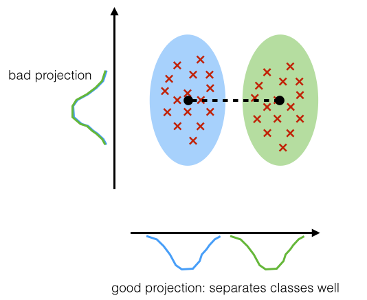
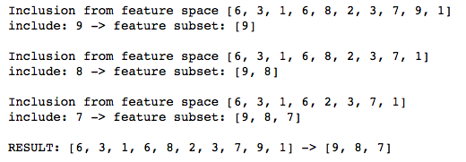
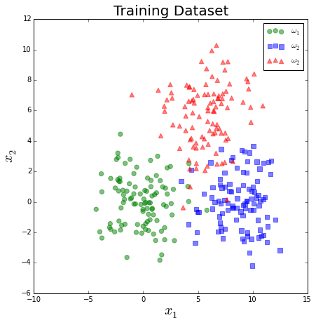
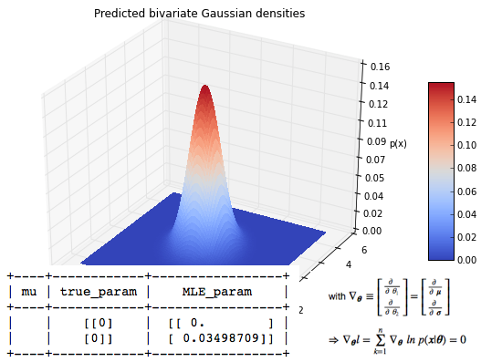
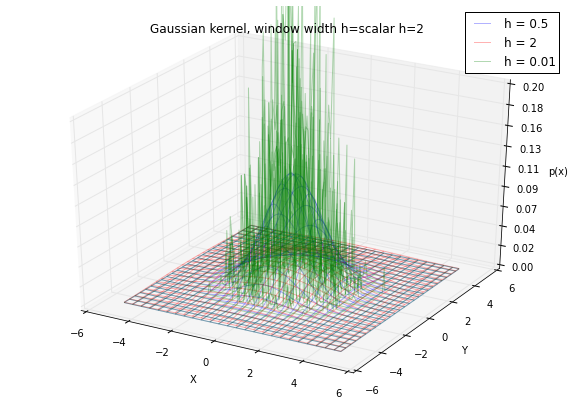

pattern_classification
======================

**A collection of tutorials and examples for solving and understanding machine learning and pattern classification tasks.**
 
 

**Newest**: <a href="#parzen">Kernel density estimation via the Parzen-window technique</a>

 

 
 
# Sections
 
&nbsp;&#8226; <a href="#dim_red"><strong>Techniques for Dimensionality 
Reduction</strong></a> 

&nbsp;&nbsp;&nbsp;&#8226; <a href="#projection">Projection</a> 
&nbsp;&nbsp;&nbsp;&nbsp;&nbsp;&nbsp;&#8226; <a href="#comp_analysis">Component Analyses</a> 
&nbsp;&nbsp;&nbsp;&nbsp;&nbsp;&nbsp;&nbsp;&nbsp;&nbsp;&nbsp;&#8226; <a href="#linear_transf">Linear Transformation</a> 
&nbsp;&nbsp;&nbsp;&nbsp;&nbsp;&nbsp;&nbsp;&nbsp;&nbsp;&nbsp;&nbsp;&nbsp;&nbsp;&nbsp;&#8226; <a href="#pca">Principal Component Analysis (PCA)</a> 
&nbsp;&nbsp;&nbsp;&nbsp;&nbsp;&nbsp;&nbsp;&nbsp;&nbsp;&nbsp;&nbsp;&nbsp;&nbsp;&nbsp;&#8226; <a href="#mda">Multiple Discriminant Analysis (MDA)</a> 

&nbsp;&nbsp;&nbsp;&#8226; <a href="#feat_sel"><strong>Feature Selection</a></strong> 
&nbsp;&nbsp;&nbsp;&nbsp;&nbsp;&nbsp;&#8226; <a href="#seq_feat_sel_algos">Sequential Feature Selection Algorithms</a> 

&nbsp;&#8226; <a href="#est_param_tech"><strong>Techniques for Parameter Estimation</strong></a> 
&nbsp;&nbsp;&nbsp;&nbsp;&nbsp;&nbsp;&#8226; <a href="#est_param">Parametric Techniques</a> 
&nbsp;&nbsp;&nbsp;&nbsp;&nbsp;&nbsp;&nbsp;&nbsp;&nbsp;&#8226; <a href="#mle">Introduction to the Maximum Likelihood Estimate (MLE)</a> 
&nbsp;&nbsp;&nbsp;&nbsp;&nbsp;&nbsp;&nbsp;&nbsp;&nbsp;&#8226; <a href="#mle_dist">How to calculate Maximum Likelihood Estimates (MLE) for different distributions</a>
 
&nbsp;&nbsp;&nbsp;&nbsp;&nbsp;&nbsp;&#8226; <a href="#est_nonparam"> Non-Parametric Techniques</a> 
&nbsp;&nbsp;&nbsp;&nbsp;&nbsp;&nbsp;&nbsp;&nbsp;&nbsp;&#8226; <a href="#parzen">Kernel density estimation via the Parzen-window technique</a> 
&nbsp;&nbsp;&nbsp;&nbsp;&nbsp;&nbsp;&nbsp;&nbsp;&nbsp;&#8226; The K-Nearest Neighbor (KNN) technique
 
 
&#8226; <a href="#stat_pat_rec"><strong>Statistical Pattern Recognition Examples</strong></a> 

&nbsp;&nbsp;&nbsp;&#8226; <a href="#supervised">Supervised Learning</a> 
&nbsp;&nbsp;&nbsp;&nbsp;&nbsp;&nbsp;&#8226; <a href="#param">Parametric Techniques</a> 
&nbsp;&nbsp;&nbsp;&nbsp;&nbsp;&nbsp;&nbsp;&nbsp;&nbsp;&#8226; <a href="#univar">Univariate Normal Density</a> 
&nbsp;&nbsp;&nbsp;&nbsp;&nbsp;&nbsp;&nbsp;&nbsp;&nbsp;&#8226; <a href="#multivar">Multivariate Normal Density</a> 
&nbsp;&nbsp;&nbsp;&nbsp;&nbsp;&nbsp;&#8226; Non-Parametric Techniques 

&nbsp;&nbsp;&nbsp;&#8226; Unsupervised Learning 

 
 

 
 

#Techniques for Dimensionality Reduction
[[back to top](#sections)]

## Projection
[[back to top](#sections)]

### Component Analyses
[[back to top](#sections)]

### Linear Transformation
[[back to top](#sections)]
 
 

#### Principal Component Analyses (PCA)
[[back to top](#sections)]
  

  
[View IPython Notebook](http://nbviewer.ipython.org/github/rasbt/pattern_classification/blob/master/dimensionality_reduction/projection/principal_component_analysis.ipynb?create=1)  

[Download PDF](https://github.com/rasbt/pattern_classification/raw/master/PDFs/principal_component_analysis_sebastian_raschka.pdf)

 
 

#### Multiple Discriminant Analysis (MDA)
[[back to top](#sections)]
  

  
[View IPython Notebook](http://nbviewer.ipython.org/github/rasbt/pattern_classification/blob/master/dimensionality_reduction/projection/multiple_discriminant_analysis.ipynb?create=1)  
 
 
 
 

## Feature Selection
[[back to top](#sections)]

#### Sequential Feature Selection Algorithms
[[back to top](#sections)]

[View IPython Notebook](http://nbviewer.ipython.org/github/rasbt/pattern_classification/blob/master/dimensionality_reduction/feature_selection/sequential_selection_algorithms.ipynb?create=1)  
 
[Download PDF](https://github.com/rasbt/pattern_classification/tree/master/dimensionality_reduction/feature_selection/sequential_selection_algorithms.pdf)
 
 
 
 

## Techniques for Parameter Estimation
[[back to top](#sections)]
 
 

### Parametric Techniques
[[back to top](#sections)]

### Introduction to the Maximum Likelihood Estimate (MLE)
[[back to top](#sections)]
 

[View IPython Notebook](http://nbviewer.ipython.org/github/rasbt/pattern_classification/blob/master/parameter_estimation_techniques/maximum_likelihood_estimate.ipynb?create=1)
 

### Maximum Liklihood parameter Estimation (MLE) for different distributions
[[back to top](#sections)]
 
 

[View IPython Notebook](http://nbviewer.ipython.org/github/rasbt/pattern_classification/blob/master/parameter_estimation_techniques/max_likelihood_est_distributions.ipynb?create=1)
  
  

### Non-Parametric Techniques
[[back to top](#sections)]

 
 

### Kernel density estimation via the Parzen-window technique
[[back to top](#sections)]
 

[View IPython Notebook](http://nbviewer.ipython.org/github/rasbt/pattern_classification/blob/master/parameter_estimation_techniques/parzen_window_technique.ipynb?create=1)  

[Download PDF](https://github.com/rasbt/pattern_classification/raw/master/PDFs/parzen_window_sebastian_raschka.pdf)
 
 
 
 
 
 
 

# Statistical Pattern Recognition
[[back to top](#sections)]

## Supervised Learning

[[back to top](#sections)]

### Parametric Techniques

[[back to top](#sections)]

#### Univariate Normal Density
[[back to top](#sections)]

## Example 1
[[back to top](#sections)]

##### Problem Category:
- Statistical Pattern Recognition   
- Supervised Learning  
- Parametric Learning  
- Bayes Decision Theory  
- Univariate data  
- 2-class problem
- equal variances
- equal priors
- Gaussian model (2 parameters)
- No Risk function

[View IPython Notebook](http://nbviewer.ipython.org/github/rasbt/pattern_classification/blob/master/stat_pattern_class/supervised/parametric/1_stat_superv_parametric.ipynb?create=1)  
 
[Download PDF](https://github.com/rasbt/pattern_classification/raw/master/stat_pattern_class/supervised/parametric/1_stat_superv_parametric.pdf)

## Example 2
[[back to top](#sections)]

##### Problem Category:
- Statistical Pattern Recognition   
- Supervised Learning  
- Parametric Learning  
- Bayes Decision Theory  
- Univariate data  
- 2-class problem
- different variances
- equal priors
- Gaussian model (2 parameters)
- No Risk function

[View IPython Notebook](http://nbviewer.ipython.org/github/rasbt/pattern_classification/blob/master/stat_pattern_class/supervised/parametric/2_stat_superv_parametric.ipynb?create=1)  
 
[Download PDF](https://github.com/rasbt/pattern_classification/raw/master/stat_pattern_class/supervised/parametric/2_stat_superv_parametric.pdf)

## Example 3
[[back to top](#sections)]

##### Problem Category:
- Statistical Pattern Recognition   
- Supervised Learning  
- Parametric Learning  
- Bayes Decision Theory  
- Univariate data  
- 2-class problem
- equal variances
- different priors
- Gaussian model (2 parameters)
- No Risk function

[View IPython Notebook](http://nbviewer.ipython.org/github/rasbt/pattern_classification/blob/master/stat_pattern_class/supervised/parametric/3_stat_superv_parametric.ipynb?create=1)  
 
[Download PDF](https://github.com/rasbt/pattern_classification/raw/master/stat_pattern_class/supervised/parametric/3_stat_superv_parametric.pdf)

## Example 4
[[back to top](#sections)]

##### Problem Category:
- Statistical Pattern Recognition   
- Supervised Learning  
- Parametric Learning  
- Bayes Decision Theory  
- Univariate data  
- 2-class problem
- different variances
- different priors
- Gaussian model (2 parameters)
- With conditional Risk (loss functions)

[View IPython Notebook](http://nbviewer.ipython.org/github/rasbt/pattern_classification/blob/master/stat_pattern_class/supervised/parametric/4_stat_superv_parametric.ipynb?create=1)  
 
[Download PDF](https://github.com/rasbt/pattern_classification/raw/master/stat_pattern_class/supervised/parametric/4_stat_superv_parametric.pdf)

## Example 5
[[back to top](#sections)]

##### Problem Category:
- Statistical Pattern Recognition   
- Supervised Learning  
- Parametric Learning  
- Bayes Decision Theory  
- Univariate data  
- 2-class problem
- different variances
- equal priors
- **Cauchy model** (2 parameters)
- With conditional Risk (1-0 loss functions)

[View IPython Notebook](http://nbviewer.ipython.org/github/rasbt/pattern_classification/blob/master/stat_pattern_class/supervised/parametric/6_stat_superv_parametric.ipynb?create=1)  
 
[Download PDF](https://github.com/rasbt/pattern_classification/raw/master/stat_pattern_class/supervised/parametric/6_stat_superv_parametric.pdf)

#### Multivariate Normal Density

## Example 1
[[back to top](#sections)]

##### Problem Category:
- Statistical Pattern Recognition   
- Supervised Learning  
- Parametric Learning  
- Bayes Decision Theory  
- Multivariate data (2-dimensional)
- 2-class problem
- different variances
- equal prior probabilities
- Gaussian model (2 parameters)
- with conditional Risk (1-0 loss functions)

[View IPython Notebook](http://nbviewer.ipython.org/github/rasbt/pattern_classification/blob/master/stat_pattern_class/supervised/parametric/5_stat_superv_parametric.ipynb?create=1)  
 
[Download PDF](https://github.com/rasbt/pattern_classification/raw/master/stat_pattern_class/supervised/parametric/5_stat_superv_parametric.pdf)

 

