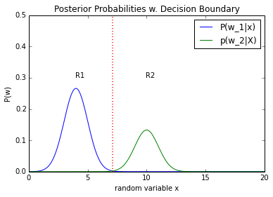
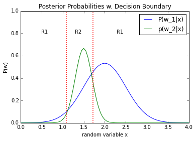
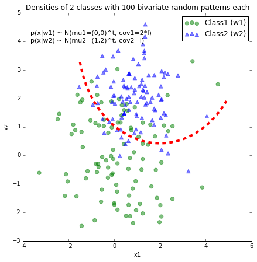

pattern_classification
======================

Examples for solving pattern classification problems in Python (IPython Notebooks)

 
 

# Sections
&#8226; <a href="#stat_pat_rec">Statistical Pattern Recognition</a> 
&nbsp;&nbsp;&nbsp;&#8226; <a href="#supervised">Supervised Learning</a> 
&nbsp;&nbsp;&nbsp;&nbsp;&nbsp;&nbsp;&#8226; <a href="#param">Parametric Techniques</a> 
&nbsp;&nbsp;&nbsp;&nbsp;&nbsp;&nbsp;&nbsp;&nbsp;&nbsp;&#8226; <a href="#univar">Univariate Normal Density</a> 
&nbsp;&nbsp;&nbsp;&nbsp;&nbsp;&nbsp;&nbsp;&nbsp;&nbsp;&#8226; <a href="#multivar">Multivariate Normal Density</a> 
&nbsp;&nbsp;&nbsp;&nbsp;&nbsp;&nbsp;&nbsp;&nbsp;&nbsp;&#8226; <a href="#seq_feat_sel_algos">Sequential Feature Selection Algorithms</a> 
&nbsp;&nbsp;&nbsp;&nbsp;&nbsp;&nbsp;&#8226; Non-Parametric Techniques 
&nbsp;&nbsp;&nbsp;&#8226; Unsupervised Learning

 
 

# Statistical Pattern Recognition

## Supervised Learning

### Parametric Approach

#### Univariate Normal Density

## Example 1

##### Problem Category:
- Statistical Pattern Recognition   
- Supervised Learning  
- Parametric Learning  
- Bayes Decision Theory  
- Univariate data  
- 2-class problem
- equal variances
- equal priors
- Gaussian model (2 parameters)
- No Risk function

[View IPython Notebook](http://nbviewer.ipython.org/github/rasbt/pattern_classification/blob/master/stat_pattern_class/supervised/parametric/1_stat_superv_parametric.ipynb?create=1)  
 
[Download PDF](https://github.com/rasbt/pattern_classification/raw/master/stat_pattern_class/supervised/parametric/1_stat_superv_parametric.pdf)

## Example 2

##### Problem Category:
- Statistical Pattern Recognition   
- Supervised Learning  
- Parametric Learning  
- Bayes Decision Theory  
- Univariate data  
- 2-class problem
- different variances
- equal priors
- Gaussian model (2 parameters)
- No Risk function

[View IPython Notebook](http://nbviewer.ipython.org/github/rasbt/pattern_classification/blob/master/stat_pattern_class/supervised/parametric/2_stat_superv_parametric.ipynb?create=1)  
 
[Download PDF](https://github.com/rasbt/pattern_classification/raw/master/stat_pattern_class/supervised/parametric/2_stat_superv_parametric.pdf)

## Example 3

##### Problem Category:
- Statistical Pattern Recognition   
- Supervised Learning  
- Parametric Learning  
- Bayes Decision Theory  
- Univariate data  
- 2-class problem
- equal variances
- different priors
- Gaussian model (2 parameters)
- No Risk function

[View IPython Notebook](http://nbviewer.ipython.org/github/rasbt/pattern_classification/blob/master/stat_pattern_class/supervised/parametric/3_stat_superv_parametric.ipynb?create=1)  
 
[Download PDF](https://github.com/rasbt/pattern_classification/raw/master/stat_pattern_class/supervised/parametric/3_stat_superv_parametric.pdf)

## Example 4

##### Problem Category:
- Statistical Pattern Recognition   
- Supervised Learning  
- Parametric Learning  
- Bayes Decision Theory  
- Univariate data  
- 2-class problem
- different variances
- different priors
- Gaussian model (2 parameters)
- With conditional Risk (loss functions)

[View IPython Notebook](http://nbviewer.ipython.org/github/rasbt/pattern_classification/blob/master/stat_pattern_class/supervised/parametric/4_stat_superv_parametric.ipynb?create=1)  
 
[Download PDF](https://github.com/rasbt/pattern_classification/raw/master/stat_pattern_class/supervised/parametric/4_stat_superv_parametric.pdf)

## Example 5

##### Problem Category:
- Statistical Pattern Recognition   
- Supervised Learning  
- Parametric Learning  
- Bayes Decision Theory  
- Univariate data  
- 2-class problem
- different variances
- equal priors
- **Cauchy model** (2 parameters)
- With conditional Risk (1-0 loss functions)

[View IPython Notebook](http://nbviewer.ipython.org/github/rasbt/pattern_classification/blob/master/stat_pattern_class/supervised/parametric/6_stat_superv_parametric.ipynb?create=1)  
 
[Download PDF](https://github.com/rasbt/pattern_classification/raw/master/stat_pattern_class/supervised/parametric/6_stat_superv_parametric.pdf)

#### Multivariate Normal Density

## Example 1

##### Problem Category:
- Statistical Pattern Recognition   
- Supervised Learning  
- Parametric Learning  
- Bayes Decision Theory  
- Multivariate data (2-dimensional)
- 2-class problem
- different variances
- equal prior probabilities
- Gaussian model (2 parameters)
- with conditional Risk (1-0 loss functions)

[View IPython Notebook](http://nbviewer.ipython.org/github/rasbt/pattern_classification/blob/master/stat_pattern_class/supervised/parametric/5_stat_superv_parametric.ipynb?create=1)  
 
[Download PDF](https://github.com/rasbt/pattern_classification/raw/master/stat_pattern_class/supervised/parametric/5_stat_superv_parametric.pdf)

#### Sequential Feature Selection Algorithms

[View IPython Notebook](http://nbviewer.ipython.org/github/rasbt/algorithms_in_ipython_notebooks/blob/master/ipython_nbs/sequential_selection_algorithms.ipynb?create=1)  
 
[Download PDF](https://github.com/rasbt/algorithms_in_ipython_notebooks/raw/master/pdfs/sequential_selection_algorithms.pdf)

