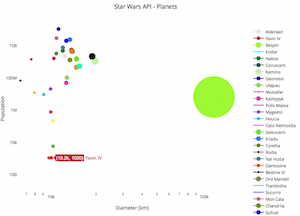
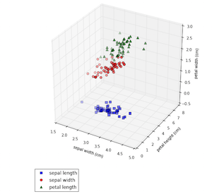
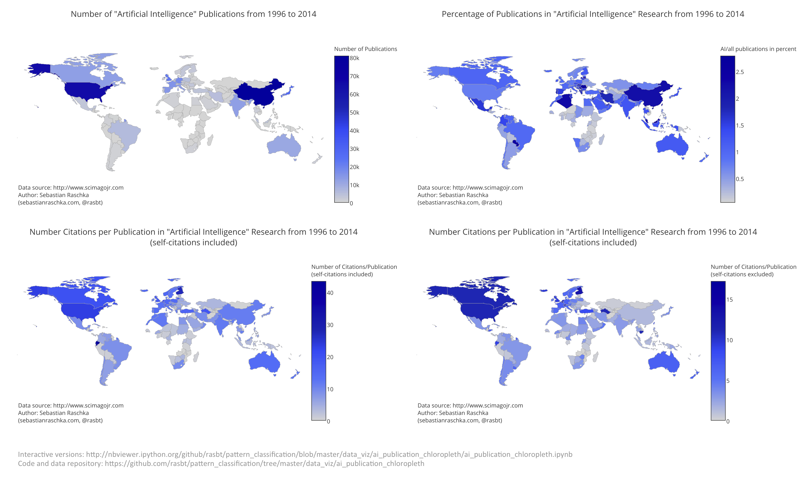
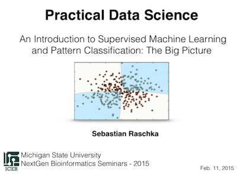
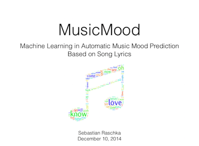
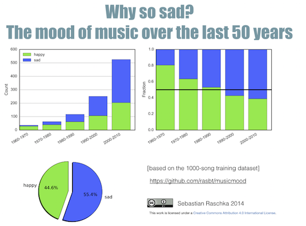
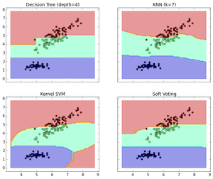

**Tutorials, examples, collections, and everything else that falls into the categories: pattern classification, machine learning, and data mining.**
 
 

 
 

# Sections

- [Introduction to Machine Learning and Pattern Classification](#introduction-to-machine-learning-and-pattern-classification)
- [Pre-Processing](#pre-processing)
- [Model Evaluation](#model-evaluation)
- [Parameter Estimation](#parameter-estimation)
- [Machine Learning Algorithms](#machine-learning-algorithms)
	- [Bayes Classification](#bayes-classification)
	- [Logistic Regression](#logistic-regression)
	- [Neural Networks](#neural-networks)
	- [Ensemble Methods](#ensemble-methods)
- [Clustering](#clustering)
- [Collecting Data](#collecting-data)
- [Data Visualization](#data-visualization)
- [Statistical Pattern Classification Examples](#statistical-pattern-classification-examples)
- [Books](#books)
- [Talks](#talks)
- [Applications](#applications)
- [Resources](#resources)

 

 

[[Download a PDF version](https://github.com/rasbt/pattern_classification/raw/master/PDFs/supervised_learning_flowchart.pdf)] of this flowchart.

 
 
 

 

### Introduction to Machine Learning and Pattern Classification
[[back to top](#sections)]

- Predictive modeling, supervised machine learning, and pattern classification - the big picture [[Markdown](./machine_learning/supervised_intro/introduction_to_supervised_machine_learning.md)]

- Entry Point: Data - Using Python's sci-packages to prepare data for Machine Learning tasks and other data analyses [[IPython nb](http://nbviewer.ipython.org/github/rasbt/pattern_classification/blob/master/machine_learning/scikit-learn/python_data_entry_point.ipynb)]

- An Introduction to simple linear supervised classification using `scikit-learn` [[IPython nb](http://nbviewer.ipython.org/github/rasbt/pattern_classification/blob/master/machine_learning/scikit-learn/scikit_linear_classification.ipynb)]

 
 
 

 

### Pre-processing

[[back to top](#sections)]

- **Feature Extraction**
	- Tips and Tricks for Encoding Categorical Features in Classification Tasks [[IPython nb](http://nbviewer.ipython.org/github/rasbt/pattern_classification/blob/master/preprocessing/feature_encoding.ipynb)]
- **Scaling and Normalization**
	- About Feature Scaling: Standardization and Min-Max-Scaling (Normalization) [[IPython nb](http://nbviewer.ipython.org/github/rasbt/pattern_classification/blob/master/preprocessing/about_standardization_normalization.ipynb)]

- **Feature Selection**
	- Sequential Feature Selection Algorithms [[IPython nb](http://nbviewer.ipython.org/github/rasbt/pattern_classification/blob/master/dimensionality_reduction/feature_selection/sequential_selection_algorithms.ipynb)]

- **Dimensionality Reduction**
	- Principal Component Analysis (PCA) [[IPython nb](http://nbviewer.ipython.org/github/rasbt/pattern_classification/blob/master/dimensionality_reduction/projection/principal_component_analysis.ipynb)]
	- The effect of scaling and mean centering of variables prior to a PCA [[PDF](https://github.com/rasbt/pattern_classification/raw/master/dimensionality_reduction/projection/scale_center_pca/scale_center_pca.pdf)] [[HTML](http://htmlpreview.github.io/?https://raw.githubusercontent.com/rasbt/pattern_classification/master/dimensionality_reduction/projection/scale_center_pca/scale_center_pca.html)]
	- PCA based on the covariance vs. correlation matrix  [[IPython nb](http://nbviewer.ipython.org/github/rasbt/pattern_classification/blob/master/dimensionality_reduction/projection/pca_cov_cor.ipynb)]

- Linear Discriminant Analysis (LDA) [[IPython nb](http://nbviewer.ipython.org/github/rasbt/pattern_classification/blob/master/dimensionality_reduction/projection/linear_discriminant_analysis.ipynb)]
	- Kernel tricks and nonlinear dimensionality reduction via PCA [[IPython nb](http://nbviewer.ipython.org/github/rasbt/pattern_classification/blob/master/dimensionality_reduction/projection/kernel_pca.ipynb)]

- **Representing Text**
	- Tf-idf Walkthrough for scikit-learn [[IPython nb](http://nbviewer.ipython.org/github/rasbt/pattern_classification/blob/master/machine_learning/scikit-learn/tfidf_scikit-learn.ipynb)]

 

 

### Model Evaluation
[[back to top](#sections)]

- An Overview of General Performance Metrics of Binary Classifier Systems [[PDF](http://sebastianraschka.com/PDFs/articles/performance_metrics.pdf)]
- **Cross-validation**
	- Streamline your cross-validation workflow - scikit-learn's Pipeline in action [[IPython nb](http://nbviewer.ipython.org/github/rasbt/pattern_classification/blob/master/machine_learning/scikit-learn/scikit-pipeline.ipynb)]

 

 

### Parameter Estimation
[[back to top](#sections)]

- **Parametric Techniques**
    - Introduction to the Maximum Likelihood Estimate (MLE) [[IPython nb](http://nbviewer.ipython.org/github/rasbt/pattern_classification/blob/master/parameter_estimation_techniques/maximum_likelihood_estimate.ipynb)]
    - How to calculate Maximum Likelihood Estimates (MLE) for different distributions [[IPython nb](http://nbviewer.ipython.org/github/rasbt/pattern_classification/blob/master/parameter_estimation_techniques/max_likelihood_est_distributions.ipynb)]

- **Non-Parametric Techniques**
	- Kernel density estimation via the Parzen-window technique [[IPython nb](http://nbviewer.ipython.org/github/rasbt/pattern_classification/blob/master/parameter_estimation_techniques/parzen_window_technique.ipynb)]
	- The K-Nearest Neighbor (KNN) technique

- **Regression Analysis**
	- Linear Regression
		- Least-Squares fit [[IPython nb](http://nbviewer.ipython.org/github/rasbt/pattern_classification/blob/master/data_fitting/regression/linregr_least_squares_fit.ipynb)]

   - Non-Linear Regression

 

 

### Machine Learning Algorithms
[[back to top](#sections)]

#### Bayes Classification

- Naive Bayes and Text Classification I - Introduction and Theory [[View PDF](http://sebastianraschka.com/PDFs/articles/naive_bayes_1.pdf)] [[Download PDF](https://github.com/rasbt/pattern_classification/raw/master/machine_learning/naive_bayes_1/tex/naive_bayes_1.pdf)]

#### Logistic Regression

- Out-of-core Learning and Model Persistence using scikit-learn
[[IPython nb](./machine_learning/scikit-learn/outofcore_modelpersistence.ipynb)]

#### Neural Networks

- Artificial Neurons and Single-Layer Neural Networks - How Machine Learning Algorithms Work Part 1 [[IPython nb](http://nbviewer.ipython.org/github/rasbt/pattern_classification/blob/master/machine_learning/singlelayer_neural_networks/singlelayer_neural_networks.ipynb)]

- Activation Function Cheatsheet [[IPython nb](http://nbviewer.ipython.org/github/rasbt/pattern_classification/blob/master/machine_learning/neural_networks/ipynb/activation_functions.ipynb)]

#### Ensemble Methods

- Implementing a Weighted Majority Rule Ensemble Classifier in scikit-learn  [[IPython nb](http://nbviewer.ipython.org/github/rasbt/pattern_classification/blob/master/machine_learning/scikit-learn/ensemble_classifier.ipynb)]

#### Decision Trees

- Cheatsheet for Decision Tree Classification [[IPython nb](http://nbviewer.ipython.org/github/rasbt/pattern_classification/blob/master/machine_learning/decision_trees/decision-tree-cheatsheet.ipynb)]

 

 

### Clustering
[[back to top](#sections)]

- **Protoype-based clustering**
- **Hierarchical clustering**
	- Complete-Linkage Clustering and Heatmaps in Python [[IPython nb](http://nbviewer.ipython.org/github/rasbt/pattern_classification/blob/master/clustering/hierarchical/clust_complete_linkage.ipynb)]
- **Density-based clustering**
- **Graph-based clustering**
- **Probabilistic-based clustering**

 

 

## Collecting Data
[[back to top](#sections)]

- Collecting Fantasy Soccer Data with Python and Beautiful Soup [[IPython nb](http://nbviewer.ipython.org/github/rasbt/pattern_classification/blob/master/data_collecting/parse_dreamteamfc_data.ipynb)]

- Download Your Twitter Timeline and Turn into a Word Cloud Using Python [[IPython nb](http://nbviewer.ipython.org/github/rasbt/pattern_classification/blob/master/data_collecting/twitter_wordcloud.ipynb)]

- Reading MNIST into NumPy arrays [[IPython nb](http://nbviewer.ipython.org/github/rasbt/pattern_classification/blob/master/data_collecting/reading_mnist.ipynb)]

 

 

## Data Visualization
[[back to top](#sections)]

- Exploratory Analysis of the Star Wars API  [[IPython nb](http://nbviewer.ipython.org/github/rasbt/pattern_classification/blob/master/data_viz/swapi_viz.ipynb)]

- Matplotlib examples -Exploratory data analysis of the Iris dataset [[IPython nb](http://nbviewer.ipython.org/github/rasbt/pattern_classification/blob/master/data_viz/matplotlib_viz_gallery.ipynb)]

- Artificial Intelligence publications per country

[[IPython nb](http://nbviewer.ipython.org/github/rasbt/pattern_classification/blob/master/data_viz/ai_publication_chloropleth/ai_publication_chloropleth.ipynb)] [[PDF](./data_viz/ai_publication_chloropleth/images/ai_publication_chloropleth.pdf)]

 

 

### Statistical Pattern Classification Examples
[[back to top](#sections)]

- **Supervised Learning**

    - Parametric Techniques
    	- Univariate Normal Density
    		- Ex1: 2-classes, equal variances, equal priors [[IPython nb](http://nbviewer.ipython.org/github/rasbt/pattern_classification/blob/master/stat_pattern_class/supervised/parametric/1_stat_superv_parametric.ipynb)]
			- Ex2: 2-classes, different variances, equal priors [[IPython nb](http://nbviewer.ipython.org/github/rasbt/pattern_classification/blob/master/stat_pattern_class/supervised/parametric/2_stat_superv_parametric.ipynb)]
			- Ex3: 2-classes, equal variances, different priors [[IPython nb](http://nbviewer.ipython.org/github/rasbt/pattern_classification/blob/master/stat_pattern_class/supervised/parametric/3_stat_superv_parametric.ipynb)]
			- Ex4: 2-classes, different variances, different priors, loss function [[IPython nb](http://nbviewer.ipython.org/github/rasbt/pattern_classification/blob/master/stat_pattern_class/supervised/parametric/4_stat_superv_parametric.ipynb)]
			- Ex5: 2-classes, different variances, equal priors, loss function, cauchy distr. [[IPython nb](http://nbviewer.ipython.org/github/rasbt/pattern_classification/blob/master/stat_pattern_class/supervised/parametric/5_stat_superv_parametric.ipynb)]

    	- Multivariate Normal Density
			- Ex5: 2-classes, different variances, equal priors, loss function [[IPython nb](http://nbviewer.ipython.org/github/rasbt/pattern_classification/blob/master/stat_pattern_class/supervised/parametric/5_stat_superv_parametric.ipynb)]
			- Ex7: 2-classes, equal variances, equal priors [[IPython nb](http://nbviewer.ipython.org/github/rasbt/pattern_classification/blob/master/stat_pattern_class/supervised/parametric/7_stat_superv_parametric.ipynb)]

    - Non-Parametric Techniques

 

 

## Books
[[back to top](#sections)]

#### Python Machine Learning

- [Amazon link](http://www.amazon.com/Python-Machine-Learning-Sebastian-Raschka/dp/1783555130/ref=sr_1_2?ie=UTF8&qid=1437754343&sr=8-2&keywords=python+machine+learning+essentials)
- [Publisher Link](https://www.packtpub.com/big-data-and-business-intelligence/python-machine-learning)
- [GitHub Code Repository](https://github.com/rasbt/python-machine-learning-book)

 

 

## Talks
[[back to top](#sections)]

#### An Introduction to Supervised Machine Learning and Pattern Classification: The Big Picture

[[View on SlideShare](http://www.slideshare.net/SebastianRaschka/nextgen-talk-022015)]

[[Download PDF](https://github.com/rasbt/pattern_classification/raw/master/PDFs/nextgentalk022015.pdf)]

 
 

#### MusicMood - Machine Learning in Automatic Music Mood Prediction Based on Song Lyrics

[[View on SlideShare](http://www.slideshare.net/SebastianRaschka/musicmood-20140912)]

[[Download PDF](https://github.com/rasbt/pattern_classification/raw/master/PDFs/musicmood20140912.pdf)]

 

 

## Applications
[[back to top](#sections)]

#### MusicMood - Machine Learning in Automatic Music Mood Prediction Based on Song Lyrics

This project is about building a music recommendation system for users who want to listen to happy songs. Such a system can not only be used to brighten up one's mood on a rainy weekend; especially in hospitals, other medical clinics, or public locations such as restaurants, the MusicMood classifier could be used to spread positive mood among people.

[[musicmood GitHub Repository](https://github.com/rasbt/musicmood)]

 

#### mlxtend - A library of extension and helper modules for Python's data analysis and machine learning libraries.

[[mlxtend GitHub Repository](https://github.com/rasbt/mlxtend)]

 

 

## Resources
[[back to top](#sections)]

- Copy-and-paste ready LaTex equations [[Markdown](./resources/latex_equations.md)]

- Open-source datasets [[Markdown](./resources/dataset_collections.md)]

- Free Machine Learning eBooks [[Markdown](./resources/machine_learning_ebooks.md)]

- Terms in data science defined in less than 50 words [[Markdown](./resources/data_glossary.md)]

- Useful libraries for data science in Python [[Markdown](./resources/python_data_libraries.md)]

- General Tips and Advices [[Markdown](./resources/general_tips_and_advices.md)]

- A matrix cheatsheat for Python, R, Julia, and MATLAB  [[HTML](http://sebastianraschka.com/github/pattern_classification/matrix_cheatsheet_table.html)]
