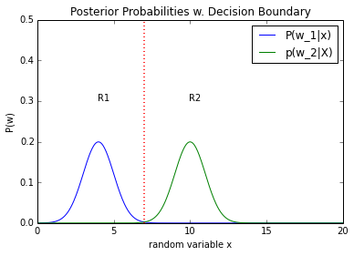
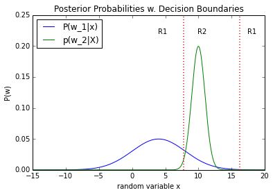

pattern_classification
======================

Examples for solving pattern classification problems in Python (IPython Notebooks)

 
 

## Example 1

##### Problem Category:
- Statistical Pattern Recognition   
- Supervised Learning  
- Parametric Learning  
- Bayes Decision Theory  
- Univariate data  
- 2-class problem
- equal variances
- equal priors
- Gaussian model (2 parameters)
- No Risk function

[View IPython Notebook](http://nbviewer.ipython.org/github/rasbt/pattern_classification/blob/master/stat_pattern_class/supervised/parametric/1_stat_superv_parametric.ipynb?create=1)  
 
[Download PDF](https://github.com/pattern_classification/blob/master/stat_pattern_class/supervised/parametric/1_stat_superv_parametric.pdf?raw=true)

## Example 2

##### Problem Category:
- Statistical Pattern Recognition   
- Supervised Learning  
- Parametric Learning  
- Bayes Decision Theory  
- Univariate data  
- 2-class problem
- different variances
- equal priors
- Gaussian model (2 parameters)
- No Risk function

[View IPython Notebook](http://nbviewer.ipython.org/github/rasbt/pattern_classification/blob/master/stat_pattern_class/supervised/parametric/2_stat_superv_parametric.ipynb?create=1)  
 
[Download PDF](https://github.com/pattern_classification/blob/master/stat_pattern_class/supervised/parametric/2_stat_superv_parametric.pdf?raw=true)

