Sebastian Raschka  
09/24/2014

# Predictive modeling, supervised machine learning, and pattern classification - the big picture

When I was working on my next pattern classification application, I realized that it might be worthwhile to take a step back and look at the big picture of pattern classification in order to put my previous topics into context and to provide and introduction for the future topics that are going to follow.  
Pattern classification and machine learning are very hot topics and used in almost every modern application: Optical Character Recognition (OCR) in the post office, spam filtering in our email clients, barcode scanners in the supermarket ... the list is endless.  
In this article, I want to give a quick overview about the main concepts of a typical supervised learning task as a primer for future articles and implementations of various learning algorithms and applications.

### Table of Contents

- [Machine Learning and pattern classification](#machine-learning-and-pattern-classification)
- [Supervised, unsupervised, and reinforcement learning](#supervised-unsupervised-and-reinforcement-learning)
- [Supervised learning - a typical workflow](#supervised-learning-a-typical-workflow)
    - [Visualization](#visualization)
    - [Workflow diagram](#workflow-diagram)
    - [Raw data collection and feature extraction](#raw-data-collection-and-feature-extraction)
    - [Sampling](#sampling)
    - [Cross-Validation](#cross-validation)
    - [Normalization](#normalization)
    - [Feature Selection and Dimensionality Reduction](#feature-selection-and-dimensionality-reduction)
    - [Learning algorithms and hyperparameter tuning](#learning-algorithms-and-hyperparameter-tuning)
    - [Prediction-error metrics and model selection](#prediction-error-metrics-and-model-selection)
- [Further Readings](#further-readings)

 
 

## Machine Learning and pattern classification
[[back to top](#table-of-contents)]

Predictive modeling is the general concept of building a model that is capable of making predictions. Typically, such a model includes a machine learning algorithm that learns certain properties from a training dataset in order to make those predictions.   
Predictive modeling can be divided further into two sub areas: Regression and pattern classification. Regression models are based on the analysis of relationships between variables and trends in order to make predictions about continuous variables, e.g., the prediction of the maximum temperature for the upcoming days in weather forecasting.  
In contrast to regression models, the task of pattern classification is to assign discrete class labels to particular observations as outcomes of a prediction. To go back to the above example: A pattern classification task in weather forecasting could be the prediction of a sunny, rainy, or snowy day.

To not get lost in all possibilities, the main focus of this article will be on "pattern classification", the general approach of assigning predefined class labels to particular instances in order to group them into discrete categories. The term "instance" is synonymous to "observation" or "sample" and describes an "object" that consists of one or multiple features (synonymous to "attributes").

 
 

## Supervised, unsupervised, and reinforcement learning
[[back to top](#table-of-contents)]

Pattern classification tasks can be grouped into two main sub-categories: Supervised and unsupervised learning. In supervised learning, the class labels in the dataset, which is used to build the classification model, are known. For example, a dataset for spam filtering would contain spam messages as well as "ham" (= not-spam) messages. In a supervised learning problem, we would know which message in the training set is spam or ham, and we'd use this information to train our model in order to classify new unseen messages.

 

 

The figure above shows an exemplary classification task for samples with two random variables; the training data (with class labels) are shown in the scatter plots. The red-dotted lines symbolize linear (left) or quadratic (right) decision boundaries that are used to define the decision regions R1 and R2. New observations will be assigned the class labels "w1" or "w2" depending on in which decision region they will fall into. We can already assume that our classification of unseen instances won't be "perfect" and some percentage samples will likely be mis-classified.

The respective IPython notebooks can be found in the ["Statistical Pattern Classification Examples"](https://github.com/rasbt/pattern_classification#statistical-pattern-classification-examples) section in my pattern classification repository if you are interested in how the decision boundaries were computed.

In contrast, unsupervised learning task deal with unlabeled instances, and the classes have to be inferred from the unstructured dataset. Typically, unsupervised learning employs a clustering technique in order to group the unlabeled samples based on certain similarity (or distance) measures.  

A third class of learning algorithms is described by the term "reinforcement learning". Here, the model is learned from a series of actions by maximizing a "reward function". The reward function can either be maximized by penalizing "bad actions" and/or rewarding "good actions". A popular example of reinforcement learning would be the training of self-driving car using feedback from the environment. Recently, I stumbled across another nice example of reinforcement learning where the game ["Flappy Bird" has been trained to play itself](http://sarvagyavaish.github.io/FlappyBirdRL/).

 
 

## Supervised learning - a typical workflow
[[back to top](#table-of-contents)]

As of today, the famous "Iris" flower dataset is probably one of the most commonly used examples when in comes to introducing various concepts in the field of "data science". The Iris dataset was created and used by R. A. Fisher [in context of his discriminant analysis in 1936](http://onlinelibrary.wiley.com/doi/10.1111/j.1469-1809.1936.tb02137.x/abstract), and it is freely [available](https://archive.ics.uci.edu/ml/datasets/Iris) at the UCI machine learning repository.  

 

 

Here, it serves as a perfect example of a supervised classification task, where the class labels are the three flower species: Setosa, Virginica, and Versicolor. And every of the 150 instances (individual flowers) consists of four features: 

- Sepal width
- Sepal length
- Petal width
- Petal height 

(all measured in centimeters).

 
 

### Visualization
[[back to top](#table-of-contents)]

When we are dealing with a new dataset, it is often useful to employ simple visualization techniques for explanatory data analysis, since the human eye is very powerful at discovering patterns. However, sometimes we have to deal with data that consists of more than three dimensions and cannot be captured in a single plot: One way to overcome such limitations could be to break down the attribute set into pairs and create a scatter plot matrix. In practice, the choice of a "good and useful" visualization technique highly depends on the type of data, the dimensionality of the feature space, and the question at hand. 

Below are just a few examples of more or less useful visualizations of the Iris dataset.

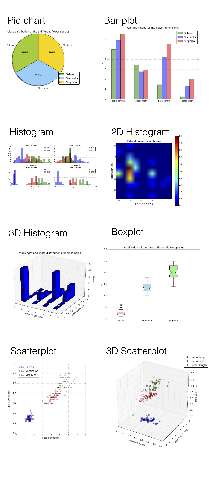

The code that was used to create these plots can be found in the IPython notebook [Matplotlib examples - Visualization techniques for exploratory data analysis](http://nbviewer.ipython.org/github/rasbt/pattern_classification/blob/master/resources/matplotlib_viz_gallery.ipynb).

Looking at those plots above, the scatter plots and (1D) histograms in particular, we can already see that the petal dimensions contain more discriminatory information than the sepal widths and lengths based on the smaller overlap between the three different flower classes. This information could, for example, be used for feature selection in order to remove noise and reduce the size of our dataset.

 
 

### Workflow diagram
[[back to top](#table-of-contents)]

In the following section, we will have a look at some of the main steps of a typical supervised learning task, and the diagram below should give us an intuitive understanding of how they are connected.

 

 
 

### Raw data collection and feature extraction
[[back to top](#table-of-contents)]

When we'd download the Iris dataset, we noticed that it is already in "good shape", and it seems that R. A. Fisher has already done some initial "pre-processing" for us: No missing data and numeric features that can be used by a learning algorithm.  
However, let us assume that the raw data of the Iris dataset consisted of a series of images. In this case, a first pre-processing step (feature extraction) could involve the scaling, translation, and rotation of those images in order to obtain the dimensions of the sepals and petals in centimeters. 

Occlusion of the leaves could be a problem that might lead to missing data: Many machine learning algorithms won't work correctly if data is missing in a dataset so that "ignoring" missing data might not be an option. If the sparsity (i.e., the amount of empty cells in the dataset) is not too high, it is often recommended to remove either the samples rows that contain missing values, or the attribute columns for which data is missing. Another strategy for dealing with missing data would be imputation: Replacement of missing values using certain statistics rather than complete removal. For categorical data, the missing value can be interpolated from the most frequent category, and the sample average can be used to interpolate missing values for numerical attributes. In general, resubstitution via k-nearest neighbor imputation is considered to be superior over resubstitution of missing data by the overall sample mean.

Other interesting approaches that are related to feature extraction could include the aggregation of petal and sepal measurements, e.g., ratios between petal or sepal widths and heights.

 
 

### Sampling
[[back to top](#table-of-contents)]
Assuming that we extracted certain features (here: sepal widths, sepal lengths, petal widths, and petal lengths) from our raw data, we would now randomly split our dataset into a training and a test dataset. The training dataset will be used to train the model, and the purpose of the test dataset is to evaluate the performance of the final model at the very end. 

It is important that we  use the test dataset only once in order to avoid overfitting when we compute the prediction-error metrics. Overfitting leads to classifiers that perform well on training data but do not generalize well so that the prediction-error on novel patterns is relatively high. Thus, techniques such as cross-validation are used in the model creation and refinement steps to evaluate the classification performance. An alternative strategy to re-use a test dataset for the model evaluation would be to create a third dataset, the so-called validation dataset.

 
 

### Cross-Validation
[[back to top](#table-of-contents)]

Cross-validation is one of the most useful techniques to evaluate different combinations of feature selection, dimensionality reduction, and learning algorithms. There are multiple flavors of cross-validation, and the most common one would probably be k-fold cross-validation.  
In k-fold cross-validation, the original training dataset is split into *k* different subsets (the so-called "folds") where 1 fold is retained as test set, and the other k-1 folds are used for training the model.
E.g., if we set *k* equal to 4 (i.e., 4 folds), 3 different subsets of the original training set would be used to train the model, and the 4th fold would be used for evaluation. After 4 iteration, we can eventually calculate the average error rate (and standard deviation) of the model, which gives us an idea of how well our model generalizes.

 

 
 

### Normalization 
[[back to top](#table-of-contents)]

Normalization and other feature scaling techniques are often mandatory in order to make comparisons between different attributes (e.g., to compute distances or similarities in cluster analysis), especially, if the attributes were measured on different scales (e.g., temperatures in Kelvin and Celsius); proper scaling of features is a requirement for most machine learning algorithms.  

The term "normalization" is often used synonymous to "Min-Max scaling": The scaling of attributes in a certain range, e.g., 0 to 1. 

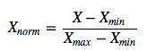

Another common approach is the process of (z-score) "standardization" or "scaling to unit-variance": Every sample is subtracted by the attribute's mean and divided by the standard deviation so that the attribute will have the properties of a standard normal distribution (&mu;=0, &sigma;=1).

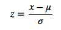

One important point that we have to keep in mind is that if we used any normalization or transformation technique on our training dataset, we'd have to use the same parameters on the test dataset and new unseen data.

More details can be found in an separate article: [About Feature Scaling and Normalization
and the effect of standardization for machine learning algorithms](http://sebastianraschka.com/Articles/2014_about_feature_scaling.html).

 
 

### Feature Selection and Dimensionality Reduction
[[back to top](#table-of-contents)]

Distinguishing between feature selection and dimensionality reduction might seem counter-intuitive at first, since feature selection will eventually lead (reduce dimensionality) to a smaller feature space.  
In practice, the key difference between the terms "feature selection" and "dimensionality reduction" is that in feature selection, we keep the "original feature axis", whereas dimensionality reduction usually involves a transformation technique.

The main purpose of those two approaches is to remove noise, increase computational efficiency by retaining only "useful" (discriminatory) information, and to avoid overfitting ("curse of dimensionality"). 

In feature selection, we are interested in retaining only those features that are "meaningful" - features that can help to build a "good" classifier. For example, if we'd have a whole bunch of attributes that describe our Iris flowers (color, height, etc.), feature selection could involve the reduction of the available data to the 4 measurements that describe the petal and sepal dimensions. Or, if we'd start with those 4 attributes (sepal and petal lengths and widths), we could further narrow down our selection to petal lengths and widths and thereby reduce our feature space from 4 to 2 dimensions. Feature selection is often based on domain knowledge (note that it is always helpful to consult a domain expert) or exploratory analyses, such as histograms or scatterplots as we have seen earlier. 
Finding the feature subset of a certain size that optimizes the performance of a classification model would require an exhaustive search - the sampling of all possible combinations. In practice, this approach might not be feasible because of computational limitations so that sequential feature selection ([Feature Selection Algorithms in Python](http://sebastianraschka.com/Articles/2014_sequential_sel_algos.html)) or genetic algorithms are being used to select a sub-optimal feature subset.

 

 

Commonly used dimensionality reduction techniques are linear transformations such as Principal Component Analyses (PCA) and Linear Discriminant Analysis (LDA). PCA can be described as an "unsupervised" algorithm, since it "ignores" class labels and its goal is to find the directions (the so-called principal components) that maximize the variance in a dataset. In contrast to PCA, LDA is "supervised" and computes the directions ("linear discriminants") that will represent the axes that maximize the separation between multiple classes.  

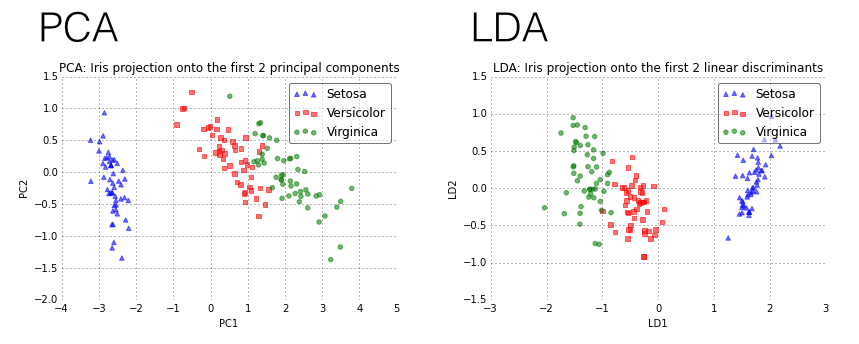

More details about PCA and LDA can be found in those two articles:

- [Linear Discriminant Analysis bit by bit](http://sebastianraschka.com/Articles/2014_python_lda.html)
- [Implementing a Principal Component Analysis (PCA) in Python step by step](http://sebastianraschka.com/Articles/2014_pca_step_by_step.html)

The image below shows the iris data plotted on a 2-dimensional feature subspace after transformation via Linear Discriminant Analysis (LDA). The black lines denote exemplary, linear decision boundaries that divide the feature space into three decision regions (R1, R2, R3). Based on these decision regions, new observations can be classified among the three different flower species: R1 &#8594; Virginica, R2 &#8594; Versicolor, and R3 &#8594; Setosa.

 
 

### Learning algorithms and hyperparameter tuning
[[back to top](#table-of-contents)]

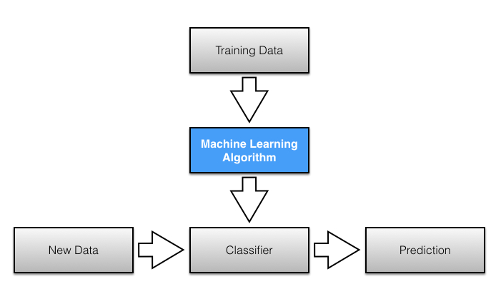

There are a enormous number of different learning algorithms, and the details about the most popular ones are perfect topics for separate articles and applications. Here is just a very brief summary of four commonly used supervised learning algorithms:

- A **Support Vector Machine (SVM)** is a classification method that samples hyperplanes which separate between two or multiple classes. Eventually, the hyperplane with the highest margin is retained, where "margin" is defined as the minimum distance from sample points to the hyperplane. The sample point(s) that form margin are called support vectors and establish the final SVM model.

- **Bayes classifiers** are based on a statistical model (i.e., Bayes theorem: calculating posterior probabilities based on the prior probability and the so-called likelihood). A Naive Bayes classifier assumes that all attributes are conditionally independent, thereby, computing the likelihood is simplified to the product of the conditional probabilities of observing individual attributes given a particular class label.

- **Artificial Neural Networks (ANN)** are graph-like classifiers that mimic the structure of a human or animal "brain" where the interconnected nodes represent the neurons.

- **Decision tree classifiers** are tree like graphs, where nodes in the graph test certain conditions on a particular set of features, and branches split the decision towards the leaf nodes. Leaves represent lowest level in the graph and determine the class labels. Optimal tree are trained by minimizing Gini impurity, or maximizing information gain.

A very simple decision tree for the iris dataset could be drawn like this:
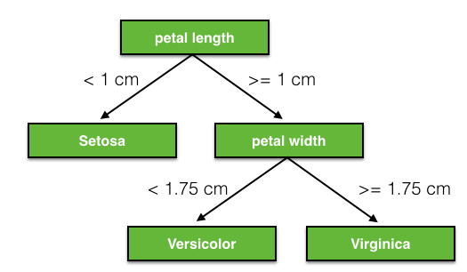

Hyperparameters are the parameters of a classifier or estimator that are not directly learned in the machine learning step from the training data but are optimized separately. The goals of hyperparameter optimization are to improve the performance of a classifier and to achieve good generalization of a learning algorithm. 
A popular method for hyperparameter optimization is Grid Search. Typically, Grid Search is implemented as an exhaustive search (in contrast to randomized parameter optimization) of candidate parameter values. After all possible parameter combination for a model are evaluated, the best combination will be retained.

 
 

### Prediction-error metrics and model selection
[[back to top](#table-of-contents)]

A convenient tool for performance evaluation is the so-called confusion matrix, which is a square matrix that consists of columns and rows that list the number of instances as "actual class" vs. "predicted class" ratios.

A confusion matrix for a simple "spam vs. ham" classification could look like:

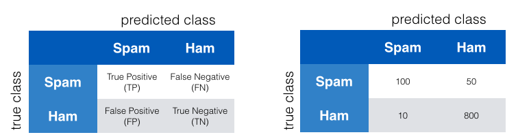

Often, the prediction "accuracy" or "error" is used to report classification performance.  
Accuracy is defined as the fraction of correct classifications out of the total number of samples; it is often used synonymous to specificity/precision although it is calculated differently. Accuracy is calculated as 

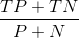

where TP=True Positives, TN=True Negatives, P=Positives, N=Negatives. 

The empirical error of a classification model can be calculated by 1-Accuracy.

However, the choice of an appropriate prediction-error metric is highly task-specific. In context of an "email spam" classification, we would especially be interested in a low false positive rate. Of course, a spam email that was classified as ham is certainly annoying, but not as bad as missing any important information by mis-classifying "ham" as "spam".

One convenient way to tweak a classifier in context of a binary classification problem such as "spam" classification is the Receiver Operating Characteristic (ROC, or ROC curve).

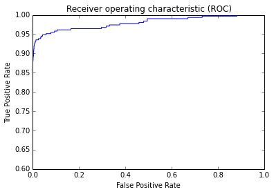

Other indicators for classification performances are **Sensitivity**, **Specificity**, **Recall**, and **Precision**.

- Sensitivity (synonymous to recall) and precision are assessing the "True Positive Rate" for a binary classification problem: The probability to make a correct prediction for a "positive/true" case (e.g., in an attempt to predict a disease, the disease is correctly predicted for a patient who truly has this disease).

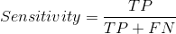

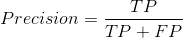

- Specificity  describes the "True Negative Rate" for a binary classification problem: The probability to make a correct prediction for a "false/negative" case (e.g., in an attempt to predict a disease, no disease is predicted for a healthy patient).

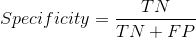

In a typical supervised learning workflow, we would evaluate various different combinations of feature subspaces, learning algorithms, and hyperparameters before we select the model that has a satisfactory performance. As mentioned above, cross-validation is a good way for such an assessment in order to avoid overfitting to our training data.

 
 

## Further Readings
[[back to top](#table-of-contents)]

I hope that this short introduction to the field of supervised learning and pattern classification could somewhat spark your interest. Below are some resources that are worthwhile reading if you want to learn more!

One of my favorite books and probably the most recommended introductory book to the topic would be ["Pattern Classification"](http://www.wiley.com/WileyCDA/WileyTitle/productCd-0471056693.html) by Richard O. Duda, Peter E. Hart, and David G. Stork.

*"I do not believe anybody wishing to teach or do serious work on Pattern Recognition can ignore this book, as it is the sort of book one wishes to find the time to read from cover to cover!" (Pattern Analysis & Applications Journal, 2001)*

*"This book is the unique text/professional reference for any serious student or worker in the field of pattern recognition." (Mathematical Reviews, Issue 2001)*

Although this review was published almost 15 years ago, it is still an excellent article that is really worth reading:

*Jain, Anil K., Robert P. W. Duin, and Jianchang Mao. 2000. [“Statistical Pattern Recognition: A Review.”](http://ieeexplore.ieee.org/xpl/login.jsp?tp=&arnumber=824819&url=http%3A%2F%2Fieeexplore.ieee.org%2Fiel5%2F34%2F17859%2F00824819) Pattern Analysis and Machine Intelligence, IEEE Transactions on 22 (1): 4–37.*

If this is not for you, you can browse through my little [collection of free ebooks](https://github.com/rasbt/pattern_classification/blob/master/resources/machine_learning_ebooks.md) from the areas of machine learning, pattern classification, and artificial intelligence.
