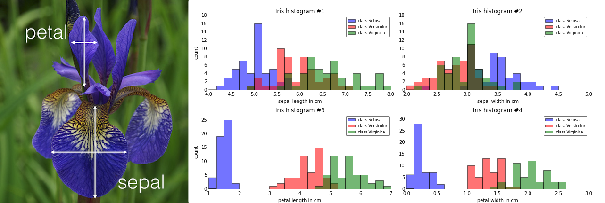
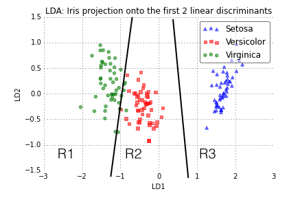

Sebastian Raschka  
09/23/2014

# Predictive modeling - A gentle introduction to supervised machine learning and pattern classification

As the introduction to my next article grew more and more in length, I decided to split it into two separate articles. Also, I realized that this might offer a good opportunity to paint the big picture for my previous machine learning related articles.

 
 

## Machine Learning and pattern classification

Predictive modeling is the general concept of building a model that is capable of making predictions. Typically, such a model includes a machine learning algorithm that learns certain properties from a training dataset in order to make those predictions.   
Predictive modeling can be divided further into two sub areas: Regression and pattern classification. Regression models are based on the analysis of relationships between variables and trends in order to make predictions about continuous variables, e.g., the prediction of the maximum temperature for the upcoming days in weather forecasting.  
In contrast to regression models, the task of pattern classification is to assign discrete class labels to particular observations as outcomes of a prediction. To go back to the above example: A pattern classification task in weather forecasting could be to predict whether tomorrow will be a sunny, rainy, or snowy day. 

To not get lost in all possibilities, the main focus of this article will be on "pattern classification", the general approach of assigning predefined class labels to particular instances in order to group them into discrete categories. The term "instance" is synonymous to "observation" or "sample" and describes an "object" that consists of one or multiple features (synonymous to "attributes").

 
 

## Supervised, unsupervised, and reinforcement learning

Pattern classification tasks, can be grouped into two main categories: supervised and unsupervised learning. In supervised learning, the class labels in the dataset, which is used to build the classification model, are known.

The figure above shows an exemplary classification task for samples with two random variables and the training dataset (with class labels) visualized in scatter plots. The red-dotted lines symbolize linear (left) or quadratic (right) decision boundaries that are used to define the decision regions R1 and R2. New observations will be assigned the class labels "w1" or "w2" depending on in which decision region they will fall into. We can already assume that our classification won't be perfect and some percentage samples will likely be mis-classified.

The plots stem from the ["Statistical Pattern Classification Examples"](https://github.com/rasbt/pattern_classification#statistical-pattern-classification-examples) section in my pattern classification repository if you are interested in how the decision boundaries were computed.

In contrast, instances are not labeled in unsupervised learning tasks, and classes have to be inferred from the unstructured dataset. Typically, unsupervised learning employs a clustering technique in order to group the unlabeled samples based on certain similarity (or distance) measures.  

A third class of learning algorithms is described by the term "reinforcement learning". Here, the model is learned from a series of actions by maximizing a "reward function". The reward function can either be maximized by penalizing "bad actions" and/or rewarding "good actions". A popular example would be the training of self-driving car using feedback from the environment. I stumbled across another nice example of reinforcement learning recently, where the game ["Flappy Bird" has been trained to play itself](http://sarvagyavaish.github.io/FlappyBirdRL/).

 
 

## Supervised learning - a typical workflow

As of today, the famous "Iris" flower dataset is probably one of the most commonly used examples for teaching introductory machine learning. It was created and used by R. A. Fisher [in context of his discriminant analysis in 1936](http://onlinelibrary.wiley.com/doi/10.1111/j.1469-1809.1936.tb02137.x/abstract), and it is freely [available](https://archive.ics.uci.edu/ml/datasets/Iris) at the UCI machine learning repository.  

Here, it serves as a perfect example of a supervised classification task, where the class labels are the three flower species: Setosa, Virginica, and Versicolor. And every of the 150 instances (individual flowers) consists of four features: sepal width, sepal length, petal width, and petal height (all measured in centimeters).

The diagram below summarizes a typical supervised learning workflow, and in the following subsections we will often refer to the iris dataset.

### Raw data collection and feature extraction
The raw dataof the flower could consist of images, and a first pre-processing step (feature extraction) could involve the scaling, translation, and rotation of those images in order to obtain the dimensions of the sepals and petals in centimeters. Occlusion of the leaves could be a problem that might lead to missing data: One way to deal with missing attributes for certain samples could be to remove those samples from the dataset entirely (other strategies include the removal of attributes or the imputation of values by procedures such as k-means).  
Other interesting approaches that are related to feature extraction could include the aggregation of petal and sepal measurements, e.g., ratios between petal or sepal widths and heights.

### Sampling
Now, that we extracted some features (here: sepal width, sepal length, petal width, and petal length) from our raw data, we can split our dataset randomly into a training and a test dataset. The training dataset will be used to train the model, and the purpose of the test dataset is to evaluate the final model at the very end. It is important that we only use the test dataset exactly once in order to compute prediction-error metrics  in order to avoid overfitting (overfitting leads to classifiers that perform well on training data but do not generalize well so that the prediction-error on novel patterns is relatively high). One strategy to re-use a test dataset for the model evaluation would be to create a third dataset, the so-called validation dataset.

### Cross-Validation
A common and useful procedure to evaluate a model is cross-validation. There are multiple flavors of cross-validation where the most common one would probably be k-fold cross-validation.  
In k-fold cross-validation, the original training dataset is split into k different subsets (the so-called "folds") where 1 fold is retained for testing the classifier and the other k-1 folds are used for training.  
E.g., if we'd choose k=4 (4 folds) the classifier will be trained on the remaining using 3 different training set subsets and evaluated on the 4th fold (the test fold). This procedure is then repeated 4 times until every fold has been used as the test set once so that we can eventually calculate the average error rate of our model from the error rate of every iteration, which gives us an idea of how well our model generalizes.

### Normalization 
Normalization and feature scaling techniques are a very important pre-processing step in order to make comparisons between different attributes (e.g., distance measures in cluster analyses), especially, if the attributes are measures on different scales (e.g., temperatures on Kelvin and Celsius scales); proper scaling of features is a requirement for most machine learning algorithms.  
The term "normalization" is often used synonomous to "Min-Max scaling": The scaling of attributes to values in a certain range, e.g., 0 to 1. Another common approach is the process of  (z-score) "standardization", which can be described as the "scaling to unit-variance": Subtracting the average from every instance and dividing it by the standard deviation so that every attribute will get the properties of a standard normal distribution with mean=0 and standard deviation=1.
Other techniques can be as simple as "mean-centering" (subtracting the attribute-average from every instance).  
More details can be found in an separate article: [About Feature Scaling and Normalization
and the effect of standardization for machine learning algorithms](http://sebastianraschka.com/Articles/2014_about_feature_scaling.html).

### Feature Selection and Dimensionality Reduction
To distinguish between feature selection and dimensionality reduction might first sound counter-intuitive since both approaches have basically a common goal: The removal of noise, the increase of computational efficiency by retaining only "useful" (discriminatory) information, and avoiding the "curse of dimensionality" and overfitting.  
Feature selection describes the process of only keeping those features that are "meaningful" and can help to build a "good" classifier. For example, if we have a whole bunch of attributes that describe our Iris flowers (color, height, etc.) feature selection could involve the reduction of the available data to the 4 measurements that describe the petal and sepal dimensions. Or, if we start with those 4 attributes (sepal and petal lengths and width), we could further narrow down our selection to the petal lengths and widths and thereby reduce our feature space from 4 to 2 dimensions. Feature selection is often based on domain knowledge (note that it is always helpful to consult a domain expert) or exploratory analyses, such as histograms or scatterplots.  
In practice, the key difference between the terms "feature selection" and "dimensionality reduction" is that in feature selection, we keep the "original feature axis", whereas dimensionality reduction usually involves a transformation technique. Commonly used dimensionality reduction techniques include linear transformations such as Principal Component Analyses (PCA) and Linear Discriminant Analysis (LDA) to project the data onto a lower-dimensional subspace (note that both LDA and PCA can also be used for mere projections without decreasing the dimensionality; and LDA has even popular use cases as classifier). While LDA and PCA are related, the key difference is that LDA is "supervised" and additionally aims to obtain the directions ("linear discriminants") of the axes that maximize the separation between multiple classes.  
For more details about PCA and LDA, please see the separate articles:

- [Linear Discriminant Analysis bit by bit](http://sebastianraschka.com/Articles/2014_python_lda.html)
- [Implementing a Principal Component Analysis (PCA) in Python step by step](http://sebastianraschka.com/Articles/2014_pca_step_by_step.html)

The image above shows the iris data plotted on a 2-dimensional feature subspace after transformation via Linear Discriminant Analysis (LDA). The black lines denote exemplary, linear decision boundaries that divide the feature space into three decision regions (R1, R2, R3). Based on these decision regions, new observations can be classified among the three different flower species: R1 -> Virginica, R2 -> Versicolor, and R3 -> Setosa.

### Learning Algorithms and hyperparameter tuning

 
 

- SVM, naive Bayes, decision trees, neural networks, SGD
- hyperparameter generalization, performance

## Further Readings

I hope that this short introduction to the field of supervised learning and pattern classification could somewhat spark your interest. Below are some resources that are worthwhile reading if you want to learn more!

One of my favorite books and probably the most recommended introductory book to the topic would be ["Pattern Classification"](http://www.wiley.com/WileyCDA/WileyTitle/productCd-0471056693.html) by Richard O. Duda, Peter E. Hart, and David G. Stork.

*"I do not believe anybody wishing to teach or do serious work on Pattern Recognition can ignore this book, as it is the sort of book one wishes to find the time to read from cover to cover!" (Pattern Analysis & Applications Journal, 2001)*

*"This book is the unique text/professional reference for any serious student or worker in the field of pattern recognition." (Mathematical Reviews, Issue 2001)*

Although this review was published almost 15 years ago, it is still an excellent article that is really worth reading:

*Jain, Anil K., Robert P. W. Duin, and Jianchang Mao. 2000. [“Statistical Pattern Recognition: A Review.”](http://ieeexplore.ieee.org/xpl/login.jsp?tp=&arnumber=824819&url=http%3A%2F%2Fieeexplore.ieee.org%2Fiel5%2F34%2F17859%2F00824819) Pattern Analysis and Machine Intelligence, IEEE Transactions on 22 (1): 4–37.*

If this is not for you, you can browse through my little [collection of free ebooks](https://github.com/rasbt/pattern_classification/blob/master/resources/machine_learning_ebooks.md) from the areas of machine learning, pattern classification, and artificial intelligence.
