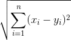
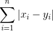
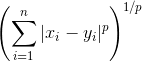

Sebastian Raschka  
last updated: 09/27/2014

# Terms in data science defined in one paragraph

 

Although, I am not a big fan of the term "data science" itself  - since it is an umbrella term that basically includes everything but means nothing in particular.  
Here, I probably finally found a context where it is useful: I think it makes this collection eligible to include anything from machine learning and pattern classification, data mining, computer science, engineering, mathematics, and statistics. I basically picture "data science" as the name of the Venn diagram of all those different fields (with extensive overlap!).

I'd be happy about contributions or to hear your comments and suggestions. 
Please feel free to drop me a note via
[twitter](https://twitter.com/rasbt), [email](mailto:bluewoodtree@gmail.com), or [google+](https://plus.google.com/+SebastianRaschka).

 

#Table of Contents

- [Accuracy](#accuracy)
- [Active Learning](#active-learning)
- [Aggregation](#aggregation)
- [Anomaly Detection](#anomaly-detection)
- [Artificial Neural Networks (ANN)](#artificial-neural-networks-ann)
- [Backtesting](#backtesting)
- [Bagging](#bagging)
- [Bag of words](#bag-of-words)
- [Batch Gradient Descent](#batch-gradient-descent)
- [Batch Learning](#batch-learning)
- [Big Data](#big-data)
- [Bootstrapping](#bootstrapping)
- [Bregman divergence](#bregman-divergence)
- [Central Limit Theorem](#central-limit-theorem)
- [Confusion Matrix](#confusion-matrix)
- [Contingency Table](#contingency-table)
- [Correlation analysis](#correlation-analysis)
- [Correlation analysis, Canonical ](#correlation-analysis-canonical)
- [Correlation analysis - Matthews Correlation Coefficient (MCC)](#correlation-analysis---matthews-correlation-coefficient)
- [Correlation analysis - Kendall](#correlation-analysis---kendall)
- [Correlation analysis - Pearson](#correlation-analysis---pearson)
- [Correlation analysis - Spearman](#correlation-analysis---spearman)
- [Cosine Similarity](#cosine-similarity)
- [Cost function](#cost-function)
- [Covariate creation](#covariate-creation)
- [Cross-validation](#cross-validation)
- [Cross-validation, K-fold](#cross-validation-k-fold)
- [Cross-validation, Leave-One-Out](#cross-validation-leave-one-out)
- [Cross-validation, Random Sampling](#cross-validation-random-sampling)
- [Curse of dimensionality](#curse-of-dimensionality)
- [Data mining](#data-mining)
- [Decision rule](#decision-rule)
- [Decision tree classifier](#decision-tree-classifier)
- [Density-based clustering](#density-based-clustering)
- [Descriptive modeling](#descriptive-modeling)
- [Dimensionality reduction](#dimensionality-reduction)
- [Distance Metric Learning](#distance-metric-learning)
- [Distance, Euclidean](#distance-euclidean)
- [Distance, Manhattan](#distance-manhattan)
- [Distance, Minkowski](#distance-minkowski)
- [Eager learners](#eager-learners)
- [Eigenvectors and Eigenvalues](#eigenvectors-and-eigenvalues)
- [Ensemble methods](#ensemble-methods)
- [Evolutionary algorithms](#evolutionary-algorithms)
- [Exhaustive search](#exhaustive-search)
- [Expectation Maximization algorithm - EM](#expectation-maximization-algorithm-em)
- [Feature Selection](#feature-selection )
- [Feature Space](#feature-space)
- [Fuzzy C-Means Clustering](#fuzzy-cmeans-clustering)
- [Generalization error](#generalization-error)
- [Genetic algorithm](#genetic-algorithm)
- [Gradient Descent](#gradient-descent)
- [Greedy Algorithm](#greedy-algorithm)
- [Grid Search](#grid-search)
- [Heuristic search](#heuristic-search)
- [Hyperparameters](#hyperparameters)
- [iid](#iid)
- [Imputation](#imputation)
- [Independent Component Analysis](#independent-component-analysis)
- [Jaccard coefficient](#jaccard-coefficient)
- [Jackknifing](#jackknifing)
- [Jittering](#jittering)
- [Kernel Density Estimation](#kernel-density-estimation)
- [Kernel (in statistics)](#kernel-in-statistics)
- [Kernel Methods](#kernel-methods)
- [Kernel Trick](#kernel-trick)
- [k-D Trees](#k-d-trees)
- [K-fold cross-validation](#k-fold-cross-validation)
- [K-Means Clustering](#k-means-clustering)
- [K-Means++ Clustering](#k-means-clustering-1)
- [K-Medoids Clustering](#k-medoids-clustering)
- [K-nearest neighbors algorithms](#k-nearest-neighbors-algorithms)
- [Knowledge Discovery in Databases (KDD)](#knowledge-discovery-in-databases-kdd)
- [LASSO Regression](#lasso-regression)
- [Latent Semantic Indexing](#latent-semantic-indexing)
- [Law of Large Numbers](#law-of-large-numbers)
- [Lazy learners](#lazy-learners)
- [Least Squares fit](#least-squares-fit)
- [Least Squares fit - linear](#least-squares-fit-linear)
- [Linear Discriminant Analysis (LDA)](#linear-discriminant-analysis-lda)
- [Local Outlier Factor (LOF)](#local-outlier-factor-lof)
- [Locality-sensitive hashing (LSH)](#locality-sensitive-hashing-lsh)
- [Logistic Regression](#logistic-regression)
- [Machine learning](#machine-learning)
- [Mahalanobis distance](#mahalanobis-distance)
- [MapRedcue](#mapreduce)
- [Markov chains](#markov-chains)
- [Maximum Likelihood Estimates (MLE)](#maximum-likelihood-estimates-mle)
- [MinHash](#minhash)
- [Monte Carlo simulation](#monte-carlo-simulation)
- [Naive Bayes Classifier](#naive-bayes-classifier)
- [N-grams](#n-grams)
- [Non-parametric statistics](#non-parametric-statistics)
- [Normal Modes](#normal-modes)
- [Normalization - Min-Max Scaling](#normalization-min-max-scaling)
- [Normalization - Standard Scores](#normalization-standard-scores)
- [Objective function](#objective-function)
- [On-Line Analytical Processing (OLAP)](#on-line-analytical-processing-olap)
- [On-Line Learning](#on-line-learning)
- [Overfitting](#overfitting)
- [Parzen-Rosenblatt Window technique](#parzen-rosenblatt-window-technique)
- [Pattern classification](#pattern-classification)
- [Perceptron](#perceptron)
- [Permissive transformations](#permissive-transformations)
- [Power transform](#power-transform)
- [Precision and Recall](#precision-and-recall)
- [Predictive Modeling](#predictive-modeling)
- [Principal Component Analysis (PCA)](#principal-component-analysis-pca)
- [Proportion of Variance Explained (PVE)](#proportion-of-variance-explained-pve)
- [Purity Measure](#purity-measure)
- [Quantitative and qualitative attributes](#quantitative-and-qualitative-attributes)
- [Random forest](#random-forest)
- [Receiver Operating Characteristic (ROC)](#receiver-operating-characteristic-roc))
- [Regularization](#regularization)
- [Reinforcement learning](#reinforcement-learning)
- [Resubstitution error](#resubstitution-error)
- [Ridge Regression](#ridge-regression)
- [Rule-based classifier](#rule-based-classifier)
- [Sampling](#sampling)
- [Sensitivity](#sensitivity)
- [Silhouette Measure (clustering)](#silhouette-measure-clustering)
- [Simple Matching Coefficient](#simple-matching-coefficient)
- [Singular Value Decomposition (SVD)](#singular-value-decomposition-svd)
- [Soft classification](#soft-classification)
- [Specificity](#specificity)
- [Stochastic Gradient Descent (SGD)](#stochastic-gradient-descent-sgd)
- [Supervised learning](#supervised-learning)
- [Support Vector Machine (SVM)](#support-vector-machine)
- [Term frequency and document frequency](#term-frequency-and-document-frequency)
- [Term frequency - inverse document frequency, Tf-idf](#term-frequency-inverse-document-frequency-tf-idf)
- [Tokenization](#tokenization)
- [Unsupervised learning](#unsupervised-learning)
- [White noise](#white-noise)
- [Whitening transformation](#whitening-transformation)

 
 

#### Accuracy
[[back to top](#table-of-contents)]

Accuracy is defined as the fraction of correct classifications out of the total number of samples; it resembles one way to assess the performance of a predictor and is often used synonymous to [specificity](#specificity)/[precision](#precision-and-recall) although it is calculated differently. Accuracy is calculated as (TP+TN)/(P+N), where TP=True Positives, TN=True Negatives, P=Positives, N=Negatives.

 
 

#### Accuracy
[[back to top](#table-of-contents)]

Accuracy is defined as the fraction of correct classifications out of the total number of samples; it resembles one way to assess the performance of a predictor and is often used synonymous to [specificity](#specificity)/[precision](#precision-and-recall) although it is calculated differently. Accuracy is calculated as (TP+TN)/(P+N), where TP=True Positives, TN=True Negatives, P=Positives, N=Negatives.

 
 

#### Active Learning
[[back to top](#table-of-contents)]

Active learning is a variant of the [on-line learning](#on-line-learning) machine learning architecture where feedback about the ground truth class labels of unseen data can be requested if the classification is uncertain. New training data that was labeled can then be used to update the model as in [on-line learning](#on-line-learning).

 
 

#### Anomaly detection
[[back to top](#table-of-contents)]

Anomaly detection describes the task of identifying points that deviate from specific patterns in a dataset --  the so-called outliers. Different types of anomaly detection methods include graph-based, statistical-based and distance-based techniques and can be used in both unsupervised and supervised learning tasks.  
(submitted by [Vahid Mirjalili](https://github.com/mirjalil))
 
 

#### Artificial Neural Networks (ANN)
[[back to top](#table-of-contents)]

Artificial Neural Networks (ANN) are a class of machine learning algorithms that are inspired by the neuron architecture of the human brain. Typically, a (multi-layer) ANN consists of a layer of input nodes, a layer of output nodes, and hidden layers in-between. The nodes are connected by weighted links that can be interpreted as the neuron-connections by axons of different strengths.
The simplest version of an ANN is a single-layer [perceptron](#perceptron).

 
 

#### Backtesting
[[back to top](#table-of-contents)]

Backtesting is a specific case of [cross-validation](#cross-validation) in the context of finance and trading models where empirical data from previous time periods (data from the past) is used to evaluate a trading strategy.

 
 

#### Bagging
[[back to top](#table-of-contents)]

Bagging is an ensemble method for classification (or regression analysis) in which individual models are trained by random sampling of data, and the final decision is made by voting among individual models with equal weights (or averaging for regression analysis).   
(submitted by [Vahid Mirjalili](https://github.com/mirjalil))

 
 

#### Bag of words
[[back to top](#table-of-contents)]

Bag of words is a model that is used to construct sparse feature vectors for text classification tasks. The bag of words is an unordered set of all words that occur in all documents that are part of the training set. Every word is then associated with a count of how often it occurs whereas the positional information is ignored. Sometimes, the bag of words is also called "dictionary" or "vocabulary" based on the training data.
 
 

#### Batch Gradient Descent

[[back to top](#table-of-contents)]

Batch Gradient descent is a variant of a [Gradient Descent](#gradient-descent) algorithm to optimize a function by finding its local minimum. In contrast to [Stochastic Gradient Descent](#stochastic-gradient-descent-sgd) the gradient is computed from the whole dataset.

 
 

#### Batch Learning

[[back to top](#table-of-contents)]

Batch learning is an architecture used in machine learning tasks where the entire training dataset is available upfront to build the model. In contrast to [on-line learning](#on-line-learning), the model is not updated once it was build on a training dataset.

 
 

#### Big Data
[[back to top](#table-of-contents)]

There are many different, controversial interpretations and definitions for the term "Big Data". Typically, one refers to data as "Big Data" if its volume and complexity are of a magnitude that the data cannot be processed by "conventional" computing platforms anymore; storage space, processing power, and database structures are typically among the limiting factors.

 
 

#### Bootstrapping
[[back to top](#table-of-contents)]

A resampling technique to that is closely related to [cross-validation](#cross-validation) where a training dataset is divided into random subsets. Bootstrapping -- in contrast to cross-validation -- is a random sampling **with** replacement. Bootstrapping is typically used for statistical estimation of bias and standard error, and a common application in machine learning is to estimate the generalization error of a predictor.

 
 

#### Bregman divergence
[[back to top](#table-of-contents)]

Bregman divergence describes are family of proximity functions (or distance measures) that share common properties and are often used in clustering algorithms. A popular example is the squared Euclidean distance.

 
 

#### Central Limit Theorem
[[back to top](#table-of-contents)]

The Central Limit Theorem is a theorem in the field of probability theory that expresses the idea
that the distribution of sample means (from independent random variables) converges to a normal distribution when the sample size approaches infinity.
 
 

#### Confusion Matrix
[[back to top](#table-of-contents)]

The confusion matrix is used as a way to represent the performance of a classifier and is sometimes also called "error matrix". This square matrix consists of columns and rows that list the number of instances as absolute or relative "actual class" vs. "predicted class" ratios.

 
 

#### Contingency Table
[[back to top](#table-of-contents)]

A contingency table is used in clustering analysis to compare the overlap between two different clustering (grouping) results. The partitions from the two clustering results are represented as rows and columns in the table, and the individual elements of the table represent the number of elements that are shared between two partitions from each clustering result.  
(submitted by [Vahid Mirjalili](https://github.com/mirjalil))

 
 

#### Correlation analysis
[[back to top](#table-of-contents)]

Correlation analysis describes and quantifies the relationship between two independent variables. Typically, in case of a positive correlation both variables have a tendency to increase, and in the case of negative correlation, one variable increases while the other variable increases. It is important to mention the famous quotation "correlation does not imply causation".

 
 

#### Correlation analysis, Canonical
Let **x** and **y** be two vectors, the goal of canonical correlation analysis is to maximize the correlation between linear transformations of those original vectors. With applications in dimensionality reduction and feature selection, CCA tries to find common dimensions between two vectors.

 
 

#### Correlation analysis - Matthews Correlation Coefficient (MCC)
[[back to top](#table-of-contents)]

MCC is an assessment metric for clustering or binary classification analyses that represents the correlation between the observed (ground truth) and predicted labels. MCC can be directly computed from the [confusion matrix](#confusion-matrix) and returns a value between -1 and 1.   
(submitted by [Vahid Mirjalili](https://github.com/mirjalil))

 
 

#### Correlation analysis - Kendall
[[back to top](#table-of-contents)]

Similar to the [Pearson correlation coefficient](#correlation-analysis-pearson), Kendall's tau measures the degree of a monotone relationship between variables, and like [Spearman's rho](#correlation-analysis-spearman), it calculates the dependence between ranked variables, which makes it feasible for non-normal distributed data. Kendall tau can be calculated for continuous as well as ordinal data. Roughly speaking, Kendall's tau distinguishes itself from Spearman's rho by stronger penalization of non-sequential (in context of the ranked variables) dislocations.

 
 

#### Correlation analysis - Pearson
[[back to top](#table-of-contents)]

The Pearson correlation coefficient is probably the most widely used measure for linear relationships between two normal distributed variables and thus often just called "correlation coefficient". Usually, the Pearson coefficient is obtained via a [Least-Squares fit](#least-squares-fit) and a value of 1 represents a perfect positive relation-ship, -1 a perfect negative relationship, and 0 indicates the absence of a relationship between variables.

 
 

#### Correlation analysis - Spearman
[[back to top](#table-of-contents)]

Related to the [Pearson correlation coefficient](#correlation-analysis-pearson), the Spearman correlation coefficient (rho) measures the relationship between two variables. Spearman's rho can be understood as a rank-based version of [Pearson's correlation coefficient](#correlation-analysis-pearson), which can be used for variables that are not normal-distributed and have a non-linear relationship. Also, its use is not only restricted to continuous data, but can also be used in analyses of ordinal attributes.

 
 

#### Cosine Similarity
[[back to top](#table-of-contents)]

Cosine similarity measures the orientation of two *n*-dimensional sample vectors irrespective to their magnitude. It is calculated by the dot product of two numeric vectors, and it is normalized by the product of the vector lengths, so that output values close to 1 indicate high similarity.  
(submitted by [Vahid Mirjalili](https://github.com/mirjalil))

 
 

#### Cosine Similarity
[[back to top](#table-of-contents)]

Cosine similarity measures the orientation of two *n*-dimensional sample vectors irrespective to their magnitude. It is calculated by the dot product of two numeric vectors, and it is normalized by the product of the vector lengths, so that output values close to 1 indicate high similarity.  
(submitted by [Vahid Mirjalili](https://github.com/mirjalil))

 
 

#### Cost function
[[back to top](#table-of-contents)]

A cost function (synonymous to loss function) is a special case of an [objective function](#objective-function), i.e., a function that is used for solving optimization problems. A cost function can take one or more input variables and the output variable is to be minimized. A typical use case for cost functions is parameter optimization.

 
 

#### Cross-validation
[[back to top](#table-of-contents)]

Cross-validation is a statistical technique to estimate the prediction error rate by splitting the data into training, cross-validation, and test datasets. A prediction model is obtained using the training set, and model parameters are optimized by the cross-validation set, while the test set is held primarily for empirical error estimation.  
(submitted by [Vahid Mirjalili](https://github.com/mirjalil))

 
 

#### Cross-validation, K-fold
[[back to top](#table-of-contents)]

K-fold cross-validation  is a variant of [cross validation](#cross-validation) where contiguous segments of samples are selected from the training dataset to build two new subsets for every iteration (without replacement): a new training and test dataset (while the original test dataset is retained for the final evaluation of the predictor). 

 
 

#### Cross-validation, Leave-One-Out
[[back to top](#table-of-contents)]

Leave-One-Out cross-validation a variant of [cross validation](#cross-validation) one sample is removed for every iteration (without replacement). The model is trained on the remaining N-1 samples and evaluated via the removed sample (while the original test dataset is retained for the final evaluation of the predictor). 

 
 

#### Cross-validation, Random Sampling
[[back to top](#table-of-contents)]

Cross-validation via random sampling is a variant of [cross validation](#cross-validation) where random chunks of samples are extracted from the training dataset to build two new subsets for every iteration  (with or without replacement): a new training and test dataset for every iteration (while the original test dataset is retained for the final evaluation of the predictor). 

 
 

#### Curse of dimensionality
[[back to top](#table-of-contents)]

For a fixed number of training samples, the curse of dimensionality describes the increased error rate for a large number of dimensions (or features) due to imprecise parameter estimations.

 
 

#### Data mining
[[back to top](#table-of-contents)]

A field that is closely related to machine learning and pattern classification. The focus of data mining does not lie in merely the collection of data, but the extraction of useful information: Discovery of patterns, and making inferences and predictions. Common techniques in data mining include predictive modeling, clustering, association rules, and anomaly detection.

 
 

#### DBSCAN
[[back to top](#table-of-contents)]

DBSCAN is a variant of a density-based clustering algorithm that identifies core points as regions of high-densities based on their number of neighbors (> *MinPts*) in a specified radius (&epsilon;). Points that are below *MinPts* but within &epsilon; are specified as border points; the remaining points are classified as noise points.   
(submitted by [Vahid Mirjalili](https://github.com/mirjalil); edited)

 
 

#### Decision rule
[[back to top](#table-of-contents)]

A function in pattern classification tasks of making an "action", e.g., assigning a certain class label to an observation or pattern.

 
 

#### Decision tree classifier
[[back to top](#table-of-contents)]

Decision tree classifiers are tree like graphs, where nodes in the graph test certain conditions on a particular set of features, and branches split the decision towards the leaf nodes. Leaves represent lowest level in the graph and determine the class labels. Optimal tree are trained by minimizing Gini impurity, or maximizing information gain.  
(submitted by [Vahid Mirjalili](https://github.com/mirjalil); edited)

 
 

#### Density-based clustering
[[back to top](#table-of-contents)]

In density-based clustering, regions of high density in n-dimensional space are identified as clusters. The best advantage of this class of clustering algorithms is that they do not require apriori knowledge of number of clusters (as opposed to [k-means](#k-means-clustering) algorithm).   
(submitted by [Vahid Mirjalili](https://github.com/mirjalil); edited)

 
 

#### Descriptive modeling
[[back to top](#table-of-contents)]

Descriptive modeling is a common task in the field of [data mining](#data-mining) where a model is build in order to distinguish between objects  and categorize them into classes - a form of data summary. In contrast to [predictive modeling](#predictive-modeling), the scope of descriptive modeling does not extend to making prediction for unseen objects.
 
 

#### Dimensionality reduction
[[back to top](#table-of-contents)]

Dimensionality reduction is a data pre-processing step in machine learning applications that aims to avoid the [curse of dimensionality](#curse-of-dimensionality) and reduce the effect of overfitting.  Dimensionality reduction is related to [feature selection](#feature-selection), but instead of selecting a feature subset, dimensionality reduction takes as projection-based approach (e.g, linear transformation) in order to create a new feature subspace.

 
 

#### Distance Metric Learning
[[back to top](#table-of-contents)]

Distance metrics are fundamental for many machine learning algorithms. Distance metric learning - instead of learning a model - incorporates estimated relevances of features to obtain a distance metric for potentially optimal separation of classes and clusters: Large distances for objects from different classes, and small distances for objects of the same class, respectively.  
(submitted by [Vahid Mirjalili](https://github.com/mirjalil); edited)

 
 

#### Distance, Euclidean
[[back to top](#table-of-contents)]

The Euclidean distance is a distance measure between two points or or vectors in a two- or multidimensional (Euclidean) space based on Pythagoras' theorem. The distance is calculated by taking the square root of the sum of the squared pair-wise distances of every dimension.  

 
 

#### Distance, Manhattan
[[back to top](#table-of-contents)]

The Manhattan distance (sometimes also called Taxicab distance) metric is related to the Euclidean distance, but instead of calculating the shortest diagonal path ("beeline") between two points, it calculates the distance based on gridlines. The Manhattan distance was named after the block-like layout of the streets in Manhattan. 

 
 

#### Distance, Minkowski
[[back to top](#table-of-contents)]

The Minkowski distance is a generalized form of the Euclidean distance (if *p=2*) and the Manhattan distance (if *p=1*).  

 
 

#### Eager learners
[[back to top](#table-of-contents)]

Eager learners (in contrast to [lazy learners](lazy-learners)) describe machine learning algorithms that learn a model for mapping attributes to class labels as soon as the data becomes available (e.g., [Decision tree classifiers](#decision-tree-classifier) or [naive Bayes classifiers](#naive-bayes-classifier)) and do not require the training data for making predictions on unseen samples once the model was built. The most computationally expensive step is the creation of a prediction model from the training data, and the actual prediction is considered as relatively inexpensive.

 
 

#### Eigenvectors and Eigenvalues
[[back to top](#table-of-contents)]

Both eigenvectors and eigenvalues fundamental in many applications involve linear systems and are related via *A&middot;v = &lambda;&middot;v* (where *A* is a square matrix, *v* the eigenvector, and &lambda; the eigenvalue). Eigenvectors are describing the direction of the axes of a linear transformation, whereas eigenvalues are describing the scale or magnitude.

 
 

#### Ensemble methods
[[back to top](#table-of-contents)]

Ensemble methods combine multiple classifiers which may differ in algorithms, input features, or input samples. Statistical analyses showed that ensemble methods yield better classification performances and are also less prone to overfitting. Different methods, e.g., bagging or boosting, are used to construct the final classification decision based on weighted votes.  
(submitted by [Vahid Mirjalili](https://github.com/mirjalil); edited)

 
 

#### Ensemble methods
[[back to top](#table-of-contents)]

Ensemble methods combine multiple classifiers which may differ in algorithms, input features, or input samples. Statistical analyses showed that ensemble methods yield better classification performances and are also less prone to overfitting. Different methods, e.g., bagging or boosting, are used to construct the final classification decision based on weighted votes.  

 
 

#### Evolutionary algorithms
[[back to top](#table-of-contents)]

Evolutionary algorithms are a class of algorithms that are based on [heuristic search](#heuristic-search) methods inspired by biological evolution in order to solve optimization problems.

 
 

#### Exhaustive search
[[back to top](#table-of-contents)]

Exhaustive search (synonymous to brute-force search) is a problem-solving approach where all possible combinations are sequentially evaluated to find the optimal solution. Exhaustive search guarantees to find the optimal solution whereas other approaches (e.g., [heuristic searches](#heuristic-search)) are regarded as sub-optimal. A downside of exhaustive searches is that computational costs increase proportional to the number of combinations to be evaluated.

 
 

#### Expectation Maximization algorithm - EM
[[back to top](#table-of-contents)]

The Expectation Maximization algorithm (EM) is a technique to estimate parameters of a distribution based on the [Maximum Likelihood Estimate (MLE)](#maximum-likelihood-estimates-mle) that is often used for the imputation of missing values in incomplete datasets. After the EM algorithm is initialized with a starting value, alternating iterations between expectation and maximization steps are repeated until convergence. In the expectation step, parameters are estimated based on the current model to impute missing values. In the maximization step, the log-likelihood function of the statistical model is to be maximized by re-estimating the parameters based on the imputed values from the expectation step.

 
 

#### Feature Selection
[[back to top](#table-of-contents)]

Feature selection is an important pre-processing step in many machine learning applications in order to avoid the [curse of dimensionality](#curse-of-dimensionality) and [overfitting](#overfitting). A subset of features is typically selected by evaluating different combinations of features and eventually retain the subset that minimizes a specified [cost function](#cost-function). Commonly used algorithms for feature selection as alternative to [exhaustive search](#exhaustive-search) algorithms include sequential selection algorithms and genetic algorithms

 
 

#### Feature Space
[[back to top](#table-of-contents)]

A feature space describes the descriptive variables  that are available for samples in a dataset as a *d*-dimensional Euclidean space. E.g., sepal length and width, and petal length and width for each flower sample in the popular Iris dataset.

 
 

#### Fuzzy C-Means Clustering
[[back to top](#table-of-contents)]

Fuzzy C-Means is a soft clustering algorithm in which each sample point has a membership degree to each cluster; in hard (crisp) clustering, membership of each point to each cluster is either 0 or 1. Fuzzy C-Means considers a weight matrix for cluster memberships, and minimizes sum squared error (SSE) of weighted distances of sample points to the cluster centroids.  
(submitted by [Vahid Mirjalili](https://github.com/mirjalil))

 
 

#### Generalization error
[[back to top](#table-of-contents)]

The generalization error describes how well new data can be classified and is a useful metric to assess the performance of a classifier. Typically, the generalization error is computed via [cross-validation](cross-validation) or simply the absolute difference between the error rate on the training and test dataset.

 
 

#### Genetic algorithm
[[back to top](#table-of-contents)]

The Genetic algorithm is a subclass of [evolutionary algorithms](#evolutionary-algorithms) that takes a heuristic approach inspired by Charles Darwin's theory of "natural selection" in order to solve optimization problems.

 
 

#### Gradient Descent
[[back to top](#table-of-contents)]

Gradient descent is an algorithm that optimizes a function by finding its local minimum. After the algorithm was initialized with an initial guess, it takes the derivative of the function to make a step towards the direction of deepest descent. This step-wise process is repeated until convergence.

 
 

#### Gradient Descent
[[back to top](#table-of-contents)]

Gradient descent is an algorithm that optimizes a function by finding its local minimum. After the algorithm was initialized with an initial guess, it takes the derivative of the function to make a step towards the direction of deepest descent. This step-wise process is repeated until convergence.

 
 

#### Greedy Algorithm
[[back to top](#table-of-contents)]

Greedy Algorithms are a family of algorithms that are used in optimization problems. A greedy algorithm makes locally optimal choices in order to find a local optimum (suboptimal solution, also see ([heuristic problem solving](#heuristic-search)).
 
 

#### Heuristic search
[[back to top](#table-of-contents)]

Heuristic search is a problem-solving approach that is focussed on efficiency rather than completeness in order to find a suboptimal solution to a problem. Heuristic search is often used as alternative approach where [exhaustive search](#exhaustive-search) is too computationally intensive and where solutions need to be approximated.

 
 

#### Hyperparameters
[[back to top](#table-of-contents)]

Hyperparameters are the parameters of a classifier or estimator that are not directly learned in the machine learning step from the training data but are optimized separately (e.g., via [Grid Search](#grid-search)). The goal of hyperparameter optimization is to achieve good generalization of a learning algorithm and to avoid overfitting to the training data.

 
 

####iid

[[back to top](#table-of-contents)]

The abbreviation "iid" stands for "independent and identically distributed" and describes random variables that are independent from one another and are drawn from a similar probability distribution. Independence means that the probability of one observation does not affect the probability of another variable (e.g., time series and network graphs are not independent).  One popular example of iid would be the tossing of a coin: One coin toss does not affect the outcome of another coin toss, and the probability of the coin landing on either "heads" or "tails" is the same for every coin toss.

 
 

#### Imputation
[[back to top](#table-of-contents)]

Imputations algorithms are designed to replace the missing data (NAs) with certain statistics rather than discarding them for downstream analysis. Commonly used imputation methods include mean imputation (replacement by the sample mean of an attribute), kNN imputation, and regression imputation.  
(submitted by [Vahid Mirjalili](https://github.com/mirjalil); edited)

 
 

#### Independent Component Analysis
[[back to top](#table-of-contents)]

Independent Component Analysis (ICA) is a statistical signal-processing technique that decomposes a multivariate dataset of mixed, non-gaussian distributed source signals into  independent components 
A popular example is the separation of overlapping voice samples -- the so-called "cocktail party problem".

 
 

#### Jaccard coefficient
[[back to top](#table-of-contents)]

The Jaccard coefficient (bounded at [0, 1)) is used as similarity measure for asymmetric binary data and calculated by taking the number of matching attributes and divide it by the number of all attributes except those where both variables have a value 0 in contrast to a [simple matching coefficient](#simple-matching-coefficient). A popular application is the identification of near-duplicate documents for which the Jaccard coefficient can be calculated by the dividing the intersection of the set of words by the union of the set words in both documents.

 
 

#### Jackknifing
[[back to top](#table-of-contents)]

Jackknifing is a resampling technique that predates the related [cross-validation](#cross-validation) and [bootstrapping](#bootstrapping) techniques and is mostly used for bias and variance estimations. In jackknifing, a dataset is split into N subsets where exactly one sample is removed from every subset so that every subset is of size N-1.

 
 

#### Jittering
[[back to top](#table-of-contents)]

Jittering is a sampling technique that can be used to measure the stability of a given statistical model (classifiction/regression/clustering). In jittering, some noise is added to sample data points, and then a new model is drawn and compared to the original model. 
(submitted by [Vahid Mirjalili](https://github.com/mirjalil))
 
 

#### k-D Trees
[[back to top](#table-of-contents)]

k-D trees are a data structures (recursive space partitioning trees) that result from the binary partitioning of multi-dimensional feature spaces. A typical application of k-D trees is to increase the search efficiency for nearest-neighbor searches. A k-D tree construction can be described as a iterating process with the following steps: Select the dimension of largest variance, draw a cutting plane based at the median along the dimension to split the data into 2 halves, choose the next dimension.

 
 

#### Kernel Density Estimation
[[back to top](#table-of-contents)]

Non-parametric techniques to estimate probability densities from the available data without requiring prior knowledge of the underlying model of the probability distribution.

 
 

#### Kernel (in statistics)
[[back to top](#table-of-contents)]

In the context of [kernel methods](#kernel-methods the term “kernel” describes a function that calculates the dot product of the images of the samples **x** under the kernel function &phi; (see kernel methods). Roughly speaking, a kernel can be understood as a similarity measure in higher-dimensional space.

 
 

#### Kernel Methods
[[back to top](#table-of-contents)]

Kernel methods are algorithms that map the sample vectors of a dataset onto a higher-dimensional feature space via a so-called kernel function (&phi;(x)). The goal is to identify  and simplify general relationships between data, which is especially useful for linearly non-separable datasets.  

 
 

#### Kernel Trick
[[back to top](#table-of-contents)]

Since the explicit computation of the [kernel](#kernel-in-statistics) is increasingly computationally expensive for large sample sizes and high numbers of dimensions, the kernel trick uses approximations to calculate the kernel implicitly. The most popular kernels used for the kernel trick are Gaussian Radius Basis Function (RBF) kernels, sigmoidal kernels, and polynomial kernels.

 
 

#### k-fold Cross-validation
[[back to top](#table-of-contents)]

In k-fold cross-validation the data is split into *k* subsets, then a prediction/classification model is trained *k* times, each time holding one subset as test set, training the model parameters using the remaining *k*-1. Finally, cross-validation error is evaluated as the average error out of all *k* training models.  
(submitted by [Vahid Mirjalili](https://github.com/mirjalil))

 
 

#### K-Means Clustering
[[back to top](#table-of-contents)]

A method of partitioning a dataset into *k* clusters by picking *k* random initial points (where *k* < *n*, the number or total points - modified by *S.R.*), assigning clusters, averaging, reassigning, and repeating until stability is achieved. The number *k* must be chosen beforehand.  
(submitted by [Jack Maney](https://github.com/jackmaney))

 
 

#### K-Means++ Clustering
[[back to top](#table-of-contents)]

A variant of [k-means](#k-means-clustering) where instead of choosing all initial centers randomly, the first is chosen randomly, the second chosen with probability proportional to the squared distance from the first, the third chosen with probability proportional to the square distance from the first two, etc. See [this paper](http://ilpubs.stanford.edu:8090/778/1/2006-13.pdf).   
(submitted by [Jack Maney](https://github.com/jackmaney))

 
 

#### K-Medoids Clustering  
[[back to top](#table-of-contents)]

K-Medoids clustering is a variant of [k-means](#k-means-clustering) algorithm in which cluster centroids are picked among the sample points rather than the mean point of each cluster. K-Medoids can overcome some of the limitations of [k-means](#k-means-clustering) algorithm by avoiding empty clusters, being more robust to outliers, and being more easily applicable to non-numeric data types.  
(submitted by [Vahid Mirjalili](https://github.com/mirjalil))

 
 

#### K-nearest neighbors algorithms  
[[back to top](#table-of-contents)]  

K-nearest neighbors algorithms find the k-points that are closest to a point of interest based on their attributes using a certain distance measure (e.g., Euclidean distance). K-nearest neighbors algorithms are being used in many different contexts: Non-parametric density estimation, missing value imputation, dimensionality reduction, and classifiers in supervised and unsupervised pattern classification and regression problems.

 
 

#### Knowledge Discovery in Databases (KDD)  
[[back to top](#table-of-contents)]

Knowledge Discovery in Databases (KDD) describes a popular workflow including [data mining](#data-mining) for extracting useful and meaningful information out of data. Typically, the individual steps are feature selection, pre-processing, transformation, [data mining](#data-mining), and post-processing (evaluation and interpretation).

 
 

#### LASSO Regression
[[back to top](#table-of-contents)]

LASSO (Least Absolute Shrinkage and Selection Operator) is a regression model that uses the L1-norm (sum of absolute values) of model coefficients to penalize the model complexity. LASSO has the advantage that some coefficients can become zero, as opposed to [ridge regression](#ridge-regression) that uses the squared sum of model coefficients.  
(submitted by [Vahid Mirjalili](https://github.com/mirjalil))

 
 

#### Latent Semantic Indexing
[[back to top](#table-of-contents)]

Latent Semantic Indexing (LSI) is a [data mining](#data-mining) technique to characterize documents by topics, word usage, or other contexts. The structures of the documents are compared by applying  [singular value decomposition](#singular-value-decomposition-svd) to an input term-document matrix (e.g., a data table of word counts with terms as row labels and document numbers as column labels) in order to obtain the singular values and vectors.

 
 

#### Law of Large Numbers
[[back to top](#table-of-contents)]

The Law of Large Numbers is a theorem in the field of probability theory that expresses the idea that the actual value of a random sampling process approaches the expected value for growing sample sizes. A common example is that the observed ratio of "heads" in an unbiased coin-flip experiment will approach 0.5 for large sample sizes. 

 
 

#### Lazy learners
[[back to top](#table-of-contents)]

Lazy learners (in contrast to [eager learners](#eager-learners)) are memorizing training data in order to make predictions for unseen samples. While there is no expensive learning step involved, the prediction step is generally considered to be more expensive compared to [eager learners](#eager-learners) since it involves the evaluation of training data. One example of lazy learners are [k-nearest neighbor algorithms](#k-nearest-neighbors-algorithms) where the class label of a unseen sample is estimated by e.g., the majority of class labels of its neighbors in the training data.

 
 

#### Least Squares fit
[[back to top](#table-of-contents)]

A regression technique to fit a linear or nonlinear model to a dataset to identify relationships between variables by minimizing the norm of residuals squared. 

 
 

#### Least Squares fit - linear
[[back to top](#table-of-contents)]

A linear regression technique that fits a straight line to a data set (or overdetermined system) by minimizing the sum of the squared residuals, which can be the minimized vertical or perpendicular offsets from the fitted line.

 
 

#### Linear Discriminant Analysis (LDA)
[[back to top](#table-of-contents)]

A linear transformation technique (related to Principal Component Analysis) that is commonly used to project a dataset onto a new feature space or feature subspace, where the new component axes maximize the spread between multiple classes, or for classification of data.

 
 

#### Local Outlier Factor (LOF)
[[back to top](#table-of-contents)]

LOF is a density-based [anomaly detection](#anomaly-detection) technique for outlier identification. The LOF for a point *p* refers to the average "reachability distance" towards its nearest neighbors. Eventually, the points with the largest LOF values (given a particular threshold) are identified as outliers.   
(submitted by [Vahid Mirjalili](https://github.com/mirjalil); edited)

 
 

#### Locality-sensitive hashing (LSH)
[[back to top](#table-of-contents)]

Locality-sensitive hashing (LSH) is a dimensionality reduction technique that groups  objects that are likely similar (based on a similarity signature such as [MinHash](#minhash)) into the same buckets in order to reduce the search space for pair-wise similarity comparisons.
One application of LSH could be a combination with other dimensionality reduction techniques, e.g., [MinHash](#minhash), in order to reduce the computational costs of finding near-duplicate document pairs.

 
 

#### Logistic Regression
[[back to top](#table-of-contents)]

Logistic regression is a statistical model used for binary classification (binomial logistic regression) where class labels are mapped to "0" or "1" outputs. Logistic regression uses the logistic function (a general form of sigmoid function), where its output ranges from (0-1).  
(submitted by [Vahid Mirjalili](https://github.com/mirjalil))

 
 

#### Machine learning

[[back to top](#table-of-contents)]

A set of algorithmic instructions for discovering and learning patterns from data e.g., to train a classifier for a pattern classification task.

 
 

#### Mahalanobis distance

[[back to top](#table-of-contents)]

The Mahalanobis distance measure accounts for the covariance among variables by calculating the distance between a sample *x* and the sample mean &mu; in units of the standard deviation.  The Mahalanobis distance becomes equal to the Euclidean distance for uncorrelated with same variances.

 
 

#### MapReduce

[[back to top](#table-of-contents)]

MapRedcue is a programming model for analyzing large datasets on distributed computer clusters, in which the task is divided into two steps, a map step and a reducer step. In the map step, the data are filtered by some factors on each compute node, then filtered data are shuffled and passed to the reducer function which performs further analysis on each portion of filtered data separately.  
(submitted by [Vahid Mirjalili](https://github.com/mirjalil))

 
 

#### Markov chains

[[back to top](#table-of-contents)]

Markov chains (names after Andrey Markov) are mathematical systems that describe the transitioning between different states in a model. The transitioning from one state to the other (or back to itself) is a stochastic process.

 
 

#### Monte Carlo simulation

[[back to top](#table-of-contents)]

A Monte Carlo simulation is an iterative sampling method for solving deterministic models. Random numbers or variables from a particular probability distribution are used as input variables for uncertain parameters to compute the response variables. 

 
 

#### Maximum Likelihood Estimates (MLE)

[[back to top](#table-of-contents)]

A technique to estimate the parameters that have been fit to a model by maximizing a known likelihood function. One common application is the estimation of "mean" and "variance" for a Gaussian distribution.

 
 

#### MinHash

[[back to top](#table-of-contents)]

MinHash is a commonly used technique for dimensionality reduction in document similarity comparisons. The idea behind MinHash is to create a signature of reduced dimensionality while preserving the [Jaccard similarity coefficient](#jaccard-coefficient). A common implementation of MinHash is to generate *k* random permutations of the columns in a *m*x*n*-document matrix (rows represent the sparse vectors of words for each document as binary data) and generate a new matrix of size *m*x*k*. The cells of the new matrix now contain the position labels of the first non-zero value for every document (1 column for each round of random permutation). Based on similarities of the position labels, the Jaccard coefficient for the pairs of documents can be calculated.
 
 

#### Naive Bayes Classifier
[[back to top](#table-of-contents)]

A classifier based on a statistical model (i.e., Bayes theorem: calculating posterior probabilities based on the prior probability and the so-called likelihood) in the field of pattern classification. Naive Bayes assumes that all attributes are conditionally independent, thereby, computing the likelihood is simplified to the product of the conditional probabilities of observing individual attributes given a particular class label. 

 
 

#### N-grams
[[back to top](#table-of-contents)]

In context of natural language processing (NLP), a text is typically broken down into individual elements (see [tokenization](#tokenization)). N-grams describe the length of the individual elements where n refers to the number of words or symbols in every token. E.g., a unigram (or 1-gram) can represent a single word, and a bigram (or 2-gram) describes a token that consists of 2 words etc.

 
 

#### Non-parametric statistics
[[back to top](#table-of-contents)]

In contrast to parametric approaches, non-parametric statistics or approaches do not make prior assumptions about the underlying probability distribution of a particular variable or attribute.

 
 

#### Normal Modes
[[back to top](#table-of-contents)]

Normal modes are the harmonic oscillations of a system of masses connected by springs, or roughly speaking "concerted motions," and all normal modes of a system are independent from each other.  A classic example describes two masses connected by a middle spring, and each mass is connected to a fixed outer edge ( |~~~m1~~m2~~~|). The oscillation of this system where the middle spring does not move is defined as its normal mode.

 
 

#### Normalization - Min-Max scaling
[[back to top](#table-of-contents)]

A data pre-processing step (also often referred to as "Feature Scaling") for fitting features from different measurements within a certain range, typically the unit range from 0 to 1.

 
 

#### Normalization - Standard Scores
[[back to top](#table-of-contents)]

A data pre-processing step (also often just called "Standardization") for re-scaling features from different measurements to match proportions of a standard normal distribution (unit variance centered at mean=0).

 
 

#### Objective function
[[back to top](#table-of-contents)]

Objective functions are mathematical function that are used for problem-solving and optimization tasks. Depending on the task, the objective function can be omtpimized through minimization ([cost or loss functions](#cost-function)) or maximization (reward function). A typical application of an objective function in pattern classification tasks is to minimize the error rate of a classifier.

 
 

#### On-Line Learning
[[back to top](#table-of-contents)]

On-line learning is a machine learning architecture where the model is being updated consecutively as new training data arrives in contrast to [batch-learning](#batch-learning), which requires the entire training dataset to be available upfront. On-line has the advantage that a model can be updated and refined over time to account for changes in the population of training samples. A popular example where on-line learning is beneficial is the task of spam detection.
 
 

#### On-Line Analytical Processing (OLAP)
[[back to top](#table-of-contents)]

On-Line Analytical Processing (OLAP) describes the general process of working with multidimensional arrays for exploratory analysis and information retrieval; often, OLAP is used to create summary data, e.g., via data aggregation across multiple dimensions or columns.

 
 

#### Parzen-Rosenblatt Window technique
[[back to top](#table-of-contents)]

A non-parametric kernel density estimation technique for probability densities of random variables if the underlying distribution/model is unknown. A so-called window function is used to count samples within hypercubes or Gaussian kernels of a specified volume to estimate the probability density.

 
 

#### Pattern classification

[[back to top](#table-of-contents)]

The usage of patterns in datasets to discriminate between classes, i.e., to assign a class label to a new observation based on inference.

 
 

#### Perceptron

[[back to top](#table-of-contents)]

A (single-layer) perceptron is a simple [Artificial Neural Network](#artificial-neural-network) algorithm that consists of only two types of nodes: Input nodes and output nodes connected by weighted links. Perceptrons are being used as linear classifiers in supervised machine learning tasks.

 
 

#### Permissive transformations

[[back to top](#table-of-contents)]

Permissive transformations are transformations of data that that do not change the "meaning" of the attributes, such as scaling or mapping. For example, the transformation of temperature measurements from a Celsius to a Kelvin scale would be a permissive transformation of a numerical attribute.

 
 

#### Power transform

[[back to top](#table-of-contents)]

Power transforms form a category of statistical transformation techniques that are used to transform non-normal distributed data to normality.

 
 

#### Principal Component Analysis (PCA)
[[back to top](#table-of-contents)]

A linear transformation technique that is commonly used to project a dataset (without utilizing class labels) onto a new feature space or feature subspace (for dimensionality reduction) where the new component axes are the directions that maximize the variance/spread of the data. 

 
 

#### Precision and Recall
[[back to top](#table-of-contents)]

Precision (synonymous to [specificity](#specificity)) and recall (synonymous to [sensitivity](#sensitivity)) are two measures to assess performance of a classifier if class label distributions are skewed.
Precision is defined as the ratio of number of relevant items out of total retrieved items, whereas recall is the fraction of relevant items which are retrieved.  
(submitted by [Vahid Mirjalili](https://github.com/mirjalil); edited)

 
 

#### Predictive Modeling
[[back to top](#table-of-contents)]

Predictive modeling a [data mining](#data-mining) task for predicting outcomes based on a statistical model that was build on previous observations (in contrast to [descriptive modeling](#descriptive-modeling)). Predictive modeling can be further divided into the three sub-tasks: Regression, classification, and ranking.
 
 

#### Proportion of Variance Explained
[[back to top](#table-of-contents)]

In the context of dimensionality reduction, the proportion of variance explained (PVE) describes how much of the total variance is captured by the new selected axes, for example,  principal components or discriminant axes. It is computed by the sum of variance of new component axes divided by the total variance.   
(submitted by [Vahid Mirjalili](https://github.com/mirjalil))

 
 

#### Purity Measure

[[back to top](#table-of-contents)]

In a cluster analysis with given truth cluster memberships (or classes), "purity" is used to assess the effectiveness of clustering. Purity is measured by assigning each cluster to the class that is maximally represented and computed via the weighted average of maximum number of samples from the same class in each cluster.  
(submitted by [Vahid Mirjalili](https://github.com/mirjalil))

 
 

#### Quantitative and qualitative attributes    
[[back to top](#table-of-contents)]

Quantitative attributes are also often called "numeric"; those are attributes for which calculations and comparisons like ratios and intervals make sense (e.g., temperature in Celsius). Qualitative, or "categorical", attributes can be grouped into to subclasses: nominal and ordinal. Where ordinal attributes (e.g., street numbers) can be ordered, nominal attributes can only distinguished by their category names (e.g., colors). 

 
 

#### Random forest

[[back to top](#table-of-contents)]

Random forest is an ensemble classifier where multiple [decision tree classifiers](#decision-tree-classifier) are learned and combined via the [bagging](#bagging) technique. Unseen/test objects are then classified by taking the majority of votes from individual decision trees.
(submitted by [Vahid Mirjalili](https://github.com/mirjalil))

 
 

#### Receiver Operating Characteristic (ROC)

[[back to top](#table-of-contents)]

The Receiver Operating Characteristic (ROC, or ROC curve) is a quality measure for binary prediction algorithms by plotting the "False positive rate" vs. the "True positive rate" ([sensitivity](#sensitivity)).

 
 

#### Regularization

[[back to top](#table-of-contents)]

Regularization is a technique to overcome overfitting by introducing a penalty term for model complexity. Usually, the penalty term is the squared sum of the model parameters, thereby promoting less complex models during training. Regularization may increase the training error but can potentially reduce the classification error on the test dataset.  
(submitted by [Vahid Mirjalili](https://github.com/mirjalil))

 
 

#### Reinforcement learning

[[back to top](#table-of-contents)]

Reinforcement learning is a machine learning algorithm that learns from a series of actions by maximizing a "reward function". The reward function can either be maximized by penalizing "bad actions" and/or rewarding "good actions".

 
 

#### Rejection sampling

[[back to top](#table-of-contents)]

Rejection sampling is similar to the popular [Monte Carlo sampling](#monte-carlo-simulation) with the difference of an additional bound. The goal of rejection sampling is to simplify the task of drawing random samples from a complex probability distribution by using a uniform distribution instead; random samples drawn from the uniform distribution that lie outside certain boundary criteria are rejected, and all samples within the boundary are accepted, respectively.

 
 

#### Resubstitution error
[[back to top](#table-of-contents)]

The resubstitution error represents the classification error rate on the training dataset (the dataset that was used to train the classifier). The performance of a classifier cannot be directly deduced from resubstitution error alone, but it becomes a useful measure for calculating the [generalization error](#generalization-error).

 
 

#### Ridge Regression

[[back to top](#table-of-contents)]

Ridge regression is a regularized regression technique in which the squared sum of the model coefficients is used to penalize model complexity.   
(submitted by [Vahid Mirjalili](https://github.com/mirjalil))

 
 

#### Rule-based classifier

[[back to top](#table-of-contents)]

Rule-based classifiers are classifiers that are based on one or more "IF ... THEN ..." rules. Rule-based classifiers are related to decision trees and can be extracted from the latter. If the requirements for a rule-based classifier (mutually exclusive: at most one rule per sample; mutuallyy exhaustive: at least one rule per sample) are violated, possible remedies include the addition of rules or the ordering of rules.

 
 

#### Sampling

[[back to top](#table-of-contents)]

Sampling is data pre-processing procedure that is used to reduce the overall size of a dataset and to reduce computational costs by selecting a representative subset from the whole input dataset.

 
 

#### Sensitivity

[[back to top](#table-of-contents)]

Sensitivity (synonymous to [precision](#precision-and-recall)), which is related to [specificity](#specificity) -- in the context of error rate evaluation -- describes the "True Positive Rate" for a binary classification problem: The probability to make a correct prediction for a "positive/true" case (e.g., in an attempt to predict a disease, the disease is correctly predicted for a patient who truly has this disease). Sensitivity is calculated as (TP)/(TP+FN), where TP=True Positives, FN=False Negatives.

 
 

#### Silhouette Measure (clustering)

[[back to top](#table-of-contents)]

Silhouette measure provides a metric to evaluate the performance of a clustering analysis. For each data point *i*, it measures the average distance of point *i* to all other points in the same cluster *(a(i))*, and the minimum distance to points from other clusters *(b(i))*. The average silhouette measures for each cluster can provide a visual way to pick the proper number of clusters.  
(submitted by [Vahid Mirjalili](https://github.com/mirjalil))

 
 

#### Simple Matching Coefficient

[[back to top](#table-of-contents)]

The simple matching coefficient is a similarity measure for binary data and calculated by dividing the total number of matches by the total number of attributes. For asymmetric binary data, the related [Jaccard coefficient](#jaccard-coefficient) is to be preferred in order to avoid highly similar scores.

 
 

#### Singular Value Decomposition (SVD)

[[back to top](#table-of-contents)]

Singular value decomposition (SVD) is linear algebra technique that decomposes matrix ***X*** into  
***U D VT*** where ***U*** (left-singular vectors) and ***V*** (right-singular vector) are both column-orthogonal, and D is a diagonal matrix that contains singular values. [PCA](#principal-component-analysis) is closely related to the right0singular vectors of SVD.  
 (submitted by [Vahid Mirjalili](https://github.com/mirjalil))

 
 

#### Soft classification

[[back to top](#table-of-contents)]

The general goal of a  [pattern classification](#pattern-classification) is to assign 
a pre-defined class labels to particular observations. Typically, in (hard) classification, only one class label is assigned to every instance whereas in soft classification, an instance can have multiple class labels. The degree to which an instance belongs to different classes is then defined by a so-called membership function.

 
 

#### Specificity

[[back to top](#table-of-contents)]

Specificity (synonymous to [recall](#precision-and-recall)), which is related to [sensitivity](#sensitivity) -- in the context of error rate evaluation -- describes the "True Negative Rate" for a binary classification problem: The probability to make a correct prediction for a "false/negative" case (e.g., in an attempt to predict a disease, no disease is predicted for a healthy patient). Specificity is calculated as (TN)/(FP+TN), where TN=True Negatives, FP=False Positives.

 
 

#### Stochastic Gradient Descent (SGD)

[[back to top](#table-of-contents)]

Stochastic Gradient Descent (SGD) (also see [Gradient Descent](#gradient-descent)) is a machine learning algorithm that seeks to minimize an objective (or cost) function and can be grouped into the category of linear classifiers for supervised learning tasks. In contrast to [Batch Gradient Descent](#batch-gradient-descent), the gradient is computed from a single sample.
 
 

#### Supervised Learning

[[back to top](#table-of-contents)]

The problem of inferring a mapping between the input space X and a target variable y when given labelled training data (i.e. (X,y) pairs). Encompasses the problems of classification (categorical y) and regression (continuous y).  
(submitted by [Alex Yakubovich](https://github.com/ayakubovich))

 
 

#### Support Vector Machine

[[back to top](#table-of-contents)]

SMV is a classification  method that tries to find the hyperplane which separates classes with highest margin. The margin is defined as the minimum distance from sample points to the hyperplane. The sample point(s) that form margin are called support vectors and eventually establish the SVM model.   
(submitted by [Vahid Mirjalili](https://github.com/mirjalil); edited)

 
 

#### Term frequency and document frequency

[[back to top](#table-of-contents)]

Term frequency and document frequency are commonly used measures in context of text classification tasks. Term frequency is the count of how often a particular word occurs in a particular document. In contrast, document frequency measures the presence or absence of a particular word in a document as a binary value. Thus, for a single document, the document frequency is either 1 or 0.

 
 

#### Term frequency - inverse document frequency, Tf-idf
[[back to top](#table-of-contents)]

Term frequency - inverse document frequency (Tf-idf) is a weighting scheme for [term frequencies and document frequencies](#term-frequency-and-document-frequency) in text classification tasks that favors terms that occur in relatively few documents. The Tf-idf is  calculated as a simple product of [term frequency](#term-frequency-and-document-frequency) and the inverse document frequency, and the latter is calculated is calculated by log("number of documents in total" / "number of documents that contain a particular term").

 
 

#### Tokenization
[[back to top](#table-of-contents)]

Tokenization, in the context of natural language processing (NLP) is the process of breaking down a text into individual elements which can consist of words or symbols. Tokenization is usually accompanied by other processing procedures such as stemming, the removal of stop words, or the creation of n-grams.

 
 

#### Unsupervised Learning

[[back to top](#table-of-contents)]

The problem of inferring latent structure in data when not given any training cases. Encompasses the problems of clustering, dimensionality reduction and density estimation.   
(submitted by [Alex Yakubovich](https://github.com/ayakubovich))

 
 

#### White noise
[[back to top](#table-of-contents)]

White noise is a source that produces random, statistically independent variables following a particular distribution. In the field of sound processing, white noise is also often referred to as a mixture of tones or sounds of different frequencies.

 
 

#### Whitening transformation

[[back to top](#table-of-contents)]

Whitening transformation is a normalization procedure to de-correlate samples in a dataset if the covariance matrix is not a diagonal matrix. Features are uncorrelated after "whitening" and their variances are equal unity, thus the covariance matrix becomes an identity matrix.

