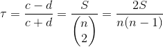
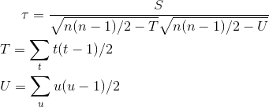
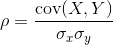
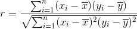
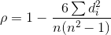
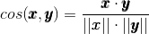
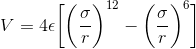
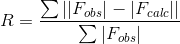

[Sebastian Raschka](http://sebastianraschka.com)

Last updated 07/12/2014

# Table of contents

- [Bayes Theorem](#bayes-theorem)
- [Binomial distribution](#binomial-distribution)
- [Correlation - Kendall](#correlation---kendall)
- [Correlation - Pearson](#correlation---pearson)
- [Correlation - Spearman](#correlation---spearman)
- [Co-Variance](#co-variance)
- [Distance, Euclidean](#distance-euclidean)
- [Distance, Manhattan](#distance-manhattan)
- [Distance, Minkowski](#distance-minkowski)
- [Eigenvector and Eigenvalue](#eigenvector-and-eigenvalue)
- [Least-squares fit regression](#least-squares-fit-regression)
- [Lennard Jones Potential](#lennard-jones-potential)
- [Linear Discriminant Analysis](#linear-discriminant-analysis)
- [Maximum Likelihood Estimate](#maximum-likelihood-estimate)
- [Min-Max scaling](#min-max-scaling)
- [Normal distribution (multivariate)](#normal-distribution-multivariate)
- [Normal distribution (univariate)](#normal-distribution-univariate)
- [Parzen window function](#parzen-window-function)
- [Population mean](#population-mean)
- [Poisson distribution (univariate)](#poisson-distribution-univariate)
- [Principal Component Analysis](#principal-component-analysis)
- [Rayleigh distribution (univariate)](#rayleigh-distribution-univariate)
- [R-factor](#r-factor)
- [Standard deviation](#standard-deviation)
- [Variance](#variance)
- [Z-score](#z-score)

I frequently embed all sorts of equations in my IPython notebooks, but instead of re-typing them every time, I thought that it might be worthwhile to have a copy&paste-ready equation glossary at hand.

Since I recently had to work without internet connection, I decided compose this in a MathJax-free manner.

For example, if you want to use those equations in a IPython notebook markdown cell, simply 
Y$-signs, e.g., 

`$\mu = 2$`    

or prepend `/begin{equation}` and append `/end{equation}`

 
 
 
 

### Bayes Theorem
[[back to top](#table-of-contents)]

- Naive Bayes' classifier:

	- posterior probability:

	

		P(\omega_j|x) = \frac{p(x|\omega_j) \cdot P(\omega_j)}{p(x)}
		
		
		
		\Rightarrow \text{posterior probability} = \frac{ \text{likelihood}  \cdot \text{prior probability}}{\text{evidence}}
 
 
	- decision rule:

	

	
    
        \text{Decide } \omega_1  \text{ if }  P(\omega_1|x) > P(\omega_2|x)  \text{ else decide } \omega_2 .
		
		\frac{p(x|\omega_1) \cdot P(\omega_1)}{p(x)} > \frac{p(x|\omega_2) \cdot P(\omega_2)}{p(x)}

	- objective functions:
	
	
	
		g_1(\pmb x) = P(\omega_1 | \; \pmb{x}), \quad  g_2(\pmb{x}) = P(\omega_2 | \; \pmb{x}), \quad  g_3(\pmb{x}) = P(\omega_2 | \; \pmb{x})

	

		\quad g_i(\pmb{x}) = \pmb{x}^{\,t} \bigg( - \frac{1}{2} \Sigma_i^{-1} \bigg) \pmb{x} + \bigg( \Sigma_i^{-1} \pmb{\mu}_{\,i}\bigg)^t \pmb x + \bigg( -\frac{1}{2} \pmb{\mu}_{\,i}^{\,t}  \Sigma_{i}^{-1} \pmb{\mu}_{\,i} -\frac{1}{2} ln(|\Sigma_i|)\bigg)

 
 

### Binomial distribution
[[back to top](#table-of-contents)]

- Probability density function:

	p_k = {n \choose x} \cdot p^k \cdot (1-p)^{n-k}

 
 

### Correlation - Kendall

[[back to top](#table-of-contents)]

Similar to the [Pearson correlation coefficient](#correlation-pearson), Kendall's tau measures the degree of a monotone relationship between variables, and like [Spearman's rho](#correlation-pearson), it calculates the dependence between ranked variables, which makes is feasible for non-normal distributed data. Kendall tau can be calculated for continuous as well as ordinal data. Roughly speaking, Kendall's tau distinguishes itself from Spearman's rho by stronger penalization of non-sequential (in context of the ranked variables) dislocations.

	\tau = \frac{c-d}{c+d} = \frac{S}{
   		\left(
   		\begin{matrix} 
     	n \\
     	2
  	\end{matrix}
  	\right)}
	= \frac{2S}{n(n-1)}

where 

*c* = the number of concordant pairs   
*d* = the number of discordant pairs  

[[ref](http://www.encyclopediaofmath.org/index.php/Kendall_tau_metric)]

If ties are present among the 2 ranked variables, the following equation shall be used instead:

	\tau = \frac{S}{\sqrt{n(n-1)/2-T}\sqrt{n(n-1)/2-U}}  \\
	\\
	T = \sum_t t(t-1)/2 \\
	\\
	U = \sum_u u(u-1)/2 \\

where  

*t* = number of observations of variable *x* that are tied  
*u* = number of observations of variable *y* that are tied  

 
 

### Correlation - Pearson

[[back to top](#table-of-contents)]

The Pearson correlation coefficient is probably the most widely used measure for linear relationships between two normal distributed variables and thus often just called "correlation coefficient". Usually, the Pearson coefficient is obtained via a [Least-Squares fit](#least-squares-fit-regression) and a value of 1 represents a perfect positive relation-ship, -1 a perfect negative relationship, and 0 indicates the absence of a relationship between variables.

    \rho = \frac{\text{cov}(X,Y)}{\sigma_x \sigma_y}
    
And the estimate  

	r = \frac{{}\sum_{i=1}^{n} (x_i - \overline{x})(y_i - \overline{y})}
	{\sqrt{\sum_{i=1}^{n} (x_i - \overline{x})^2(y_i - \overline{y})^2}}

 
 

### Correlation - Spearman

[[back to top](#table-of-contents)]

Related to the [Pearson correlation coefficient](#correlation-pearson), the Spearman correlation coefficient (rho) measures the relationship between two variables. Spearman's rho can be understood as a rank-based version of [Pearson's correlation coefficient](#correlation-pearson), which can be used for variables that are not normal-distributed and have a non-linear relationship. Also, its use is not only restricted to continuous data, but can also be used in analyses of ordinal attributes.

	\rho = 1- {\frac {6 \sum d_i^2}{n(n^2 - 1)}}
 
 where  
 *d* = the pairwise distances of the ranks of the variables *xi* and *yi* .  
 *n* = the number of samples.
 

 
 

### Cosine Similarity

[[back to top](#table-of-contents)]

Cosine similarity measures the orientation of two *n*-dimensional sample vectors irrespective to their magnitude. It is calculated by the dot product of two numeric vectors, and it is normalized by the product of the vector lengths, so that output values close to 1 indicate high similarity. 

	cos(\pmb x, \pmb y) = \frac {\pmb x \cdot \pmb y}{||\pmb x|| \cdot ||\pmb y||}
 

 
 

### Co-Variance
[[back to top](#table-of-contents)]

	S_{xy} = \sum_{i=1}^{n} (x_i - \bar{x})(y_i - \bar{y})

example covariance matrix:

	\pmb{\Sigma_1} = 
	\begin{bmatrix}1 & 0 & 0 \\
	0 & 1\ &0\\
	0 & 0 & 1
	\end{bmatrix}

 
 

### Eigenvector and Eigenvalue
[[back to top](#table-of-contents)]

    \pmb A\pmb{v} =  \lambda\pmb{v}\\\\

    \text{where} \\\\

    \pmb A = S_{W}^{-1}S_B\\
    \pmb{v} = \text{Eigenvector}\\
    \lambda = \text{Eigenvalue}
    
 
 

### Distance, Euclidean
[[back to top](#table-of-contents)]

The Euclidean distance is a distance measure between two points or or vectors in a two- or multidimensional (Euclidean) space based on Pythagoras' theorem. The distance is calculated by taking the square root of the sum of the squared pair-wise distances of every dimension.  

	\sqrt{\sum_{i=1}^n (x_i-y_i)^2}     

 
 

### Distance, Manhattan
[[back to top](#table-of-contents)]

The Manhattan distance (sometimes also called Taxicab distance) metric is related to the Euclidean distance, but instead of calculating the shortest diagonal path ("beeline") between two points, it calculates the distance based on gridlines. The Manhattan distance was named after the block-like layout of the streets in Manhattan. 

	\left(\sum_{i=1}^n |x_i-y_i|^p\right)^{1/p}

 
 

### Distance, Minkowski
[[back to top](#table-of-contents)]

The Minkowski distance is a generalized form of the Euclidean distance (if *p=2*) and the Manhattan distance (if *p=1*).  

	\left(\sum_{i=1}^n |x_i-y_i|^p\right)^{1/p}

 
 

### Least-squares fit regression
[[back to top](#table-of-contents)]

- Linear equation

	f(x) = a\cdot x + b
	
Slope:

	a = \frac{S_{x,y}}{\sigma_{x}^{2}}\quad

Y-axis intercept:

	b = \bar{y} - a\bar{x}\quad
	
where

	S_{xy} = \sum_{i=1}^{n} (x_i - \bar{x})(y_i - \bar{y})\quad \text{(covariance)} \\
	\sigma{_x}^{2} = \sum_{i=1}^{n} (x_i - \bar{x})^2\quad \text{(variance)}	
	
 
 	
	
- Matrix equation

	\pmb X \; \pmb a = \pmb y
	

	\pmb X \; \pmb a = \pmb y

    \Bigg[ \begin{array}{cc}
    x_1 & 1  \\
    ... & 1 \\
    x_n & 1  \end{array} \Bigg]$
    $\bigg[ \begin{array}{c}
    a  \\
    b \end{array} \bigg]$
    $=\Bigg[ \begin{array}{c}
    y_1   \\
    ...  \\
    y_n  \end{array} \Bigg]

	\pmb a = (\pmb X^T \; \pmb X)^{-1} \pmb X^T \; \pmb y

 
 

### Lennard-Jones Potential
[[back to top](#table-of-contents)]

The Lennard-Jones potential describes the energy potential between two non-bonded atoms based on their distance to each other.

	V = 4 \epsilon \bigg[ \bigg(\frac{\sigma}{r}\bigg)^{12}  - \bigg(\frac{\sigma}{r}\bigg)^{6} \bigg]
	
V = intermolecular potential  
&sigma; = distance where V is 0  
r = distance between atoms, measured from one center to the other  
&epsilon; = interaction strength

 
 

### Linear Discriminant Analysis
[[back to top](#table-of-contents)]

- In-between class scatter matrix

    S_W = \sum\limits_{i=1}^{c} S_i \\\\

    \text{where}  \\\\

    S_i = \sum\limits_{\pmb x \in D_i}^n (\pmb x - \pmb m_i)\;(\pmb x - \pmb m_i)^T
     \text{  (scatter matrix for every class)} \\\\

    \text{and} \\\\
      
    \pmb m_i = \frac{1}{n_i} \sum\limits_{\pmb x \in D_i}^n \; \pmb x_k   \text{ (mean vector)}

 
 

- Between class scatter matrix

	
	S_B = \sum\limits_{i=1}^{c} (\pmb m_i - \pmb m) (\pmb m_i - \pmb m)^T

 
 

### Maximum Likelihood Estimate
[[back to top](#table-of-contents)]

The probability of observing the data set 

	D = \left\{ \pmb x_1, \pmb x_2,..., \pmb x_n \right\} 
	
 can be pictured as probability to observe a particular sequence of patterns,  
where the probability of observing a particular patterns depends on **&theta;**, the parameters the underlying (class-conditional) distribution. In order to apply MLE, we have to make the assumption that the samples are *i.i.d.* (independent and identically distributed).

    p(D\; | \;  \pmb \theta\;) \\\\
    = p(\pmb x_1 \; | \; \pmb \theta\;)\; \cdot \; p(\pmb x_2 \; | \;\pmb \theta\;) \; \cdot \;...  \; p(\pmb x_n \; | \; \pmb \theta\;) \\\\
    = \prod_{k=1}^{n} \; p(\pmb x_k \pmb \; | \; \pmb \theta \;)

Where **&theta;** is the parameter vector, that contains the parameters for a particular distribution that we want to estimate.

and p(D | **&theta;**) is also called the likelihood of **&theta;**.

- log-likelihood
 

	p(D|\theta) = \prod_{k=1}^{n} p(x_k|\theta) \\
	\Rightarrow l(\theta) = \sum_{k=1}^{n} ln \; p(x_k|\theta)

- Differentiation

    \nabla_{\pmb \theta} \equiv \begin{bmatrix}  
    \frac{\partial \; }{\partial \; \theta_1} \\
    \frac{\partial \; }{\partial \; \theta_2} \\
    ...\\
    \frac{\partial \; }{\partial \; \theta_p}\end{bmatrix}

    \nabla_{\pmb \theta} l(\pmb\theta) \equiv \begin{bmatrix}  
    \frac{\partial \; L(\pmb\theta)}{\partial \; \theta_1} \\
    \frac{\partial \; L(\pmb\theta)}{\partial \; \theta_2} \\
    ...\\
    \frac{\partial \; L(\pmb\theta)}{\partial \; \theta_p}\end{bmatrix}$
    $= \begin{bmatrix}  
    0 \\
    0 \\
    ...\\
    0\end{bmatrix}

- parameter vector

    \pmb \theta_i = \bigg[ \begin{array}{c}
    \ \theta_{i1} \\
    \ \theta_{i2} \\
    \end{array} \bigg]=
    \bigg[ \begin{array}{c}
    \pmb \mu_i \\
    \pmb \Sigma_i \\
    \end{array} \bigg]

 
 

### Min-Max scaling
[[back to top](#table-of-contents)]

	X_{norm} = \frac{X - X_{min}}{X_{max}-X_{min}}

 
 

### Normal distribution (multivariate)
[[back to top](#table-of-contents)]

- Probability density function

	p(\pmb x) \sim N(\pmb \mu|\Sigma)\\\\

	p(\pmb x) \sim \frac{1}{(2\pi)^{d/2} \; |\Sigma|^{1/2}} \exp \bigg[ -\frac{1}{2}(\pmb x - \pmb \mu)^t \Sigma^{-1}(\pmb x - \pmb \mu) \bigg]

 
 

### Normal distribution (univariate)
[[back to top](#table-of-contents)]

- Probability density function

	p(x) \sim N(\mu|\sigma^2) \\\\

	p(x) \sim \frac{1}{\sqrt{2\pi\sigma^2}} \exp{ \bigg[-\frac{1}{2}\bigg( \frac{x-\mu}{\sigma}\bigg)^2 \bigg] } $

 
 

### Parzen window function
[[back to top](#table-of-contents)]

	\phi(\pmb u) = \Bigg[ \begin{array}{ll} 1 & \quad |u_j| \leq 1/2 \; ;\quad \quad j = 1, ..., d \\
	0 & \quad \text{otherwise} \end{array} 

for a hypercube of unit length 1 centered at the coordinate system's origin. What this function basically does is assigning a value 1 to a sample point if it lies within 1/2 of the edges of the hypercube, and 0 if lies outside (note that the evaluation is done for all dimensions of the sample point).

If we extend on this concept, we can define a more general equation that applies to hypercubes of any length *hn* that are centered at ***x***: 

	k_n = \sum\limits_{i=1}^{n} \phi \bigg( \frac{\pmb x - \pmb x_i}{h_n} \bigg)\\\\

	\text{where}\\\\

	\pmb u = \bigg( \frac{\pmb x - \pmb x_i}{h_n} \bigg)

- probability density estimation with hypercube kernel

	p_n(\pmb x) = \frac{1}{n} \sum\limits_{i=1}^{n} \frac{1}{h^d} \phi \bigg[ \frac{\pmb x - \pmb x_i}{h_n} \bigg]

	\text{where}\\\\   
	h^d = V_n\quad   \text{and}    \quad\phi \bigg[ \frac{\pmb x - \pmb x_i}{h_n} \bigg] = k

- probability density estimation with Gaussian kernel

	p_n(\pmb x) = \frac{1}{n} \sum\limits_{i=1}^{n} \frac{1}{h^d} \phi \Bigg[ \frac{1}{(\sqrt {2 \pi})^d h_{n}^{d}} \exp \; \bigg[ -\frac{1}{2} \bigg(\frac{\pmb x - \pmb x_i}{h_n} \bigg)^2 \bigg] \Bigg]

 
 

### Population mean
[[back to top](#table-of-contents)]

	\mu = \frac{1}{N} \sum_{i=1}^N x_i

example mean vector:

	\pmb{\mu_1} = 
	\begin{bmatrix}0\\0\\0\end{bmatrix}

 
 

### Poisson distribution (univariate)
[[back to top](#table-of-contents)]

- Probability density function

	p(x|\theta) = \frac{e^{-\theta}\theta^{xk}}{x_k!}

 
 

### Principal Component Analysis
[[back to top](#table-of-contents)]

- Scatter matrix

	S = \sum\limits_{k=1}^n (\pmb x_k - \pmb m)\;(\pmb x_k - \pmb m)^T
	
	
where 

	\pmb m = \frac{1}{n} \sum\limits_{k=1}^n \; \pmb x_k \text{   (mean vector)}

 
 

### R-factor

[[back to top](#table-of-contents)]

The R-factor is one of several measures to assess the quality of a protein crystal structure. After building and refining an atomistic model of the crystal structure, the R-factor measures how well this model can describe the experimental diffraction patterns via the equation:

	R = \frac{\sum ||F_{obs}| - |F_{calc}||}{\sum|F_{obs}|}

 
 

### Rayleigh distribution (univariate)
[[back to top](#table-of-contents)]

- Probability density function

    p(x|\theta) =  \Bigg\{ \begin{array}{c}
      2\theta xe^{- \theta x^2},\quad \quad x \geq0, \\
      0,\quad \text{otherwise.} \\
      \end{array}

 
 

### Standard deviation
[[back to top](#table-of-contents)]

	\sigma = \sqrt{\frac{1}{N} \sum_{i=1}^N (x_i - \mu)^2}
	

 
 

### Variance
[[back to top](#table-of-contents)]

	\sigma{_x}^{2} = \sum_{i=1}^{n} (x_i - \bar{x})^2\quad

 
 

### Z-score
[[back to top](#table-of-contents)]

 	z = \frac{x - \mu}{\sigma}
 	
 
 

