[Sebastian Raschka](http://sebastianraschka.com)

Last updated 07/12/2014

I frequently embed all sorts of equations in my IPython notebooks, but instead of re-typing them every time, I thought that it might be worthwhile to have a copy&paste-ready equation glossary at hand.

Since I recently had to work without internet connection, I decided compose this in a MathJax-free manner.

For example, if you want to use those equations in a IPython notebook markdown cell, simply 
Y$-signs, e.g., 

`$\mu = 2$`    

or prepend `/begin{equation}` and append `/end{equation}`

 
 
 
 

### Bayes Theorem

- Naive Bayes' classifier:

	- posterior probability:

	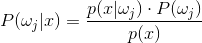

		P(\omega_j|x) = \frac{p(x|\omega_j) \cdot P(\omega_j)}{p(x)}
		
	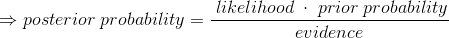	
		
		\Rightarrow posterior \; probability = \frac{\; likelihood \; \cdot \; prior \; probability}{evidence}
 
 
	- decision rule:

	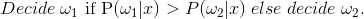

	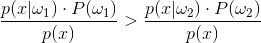
    
        Decide \;  \omega_1 $ if  P(\omega_1|x) > P(\omega_2|x) \; else \; decide \; \omega_2 .
		
		\frac{p(x|\omega_1) \cdot P(\omega_1)}{p(x)} > \frac{p(x|\omega_2) \cdot P(\omega_2)}{p(x)}

	- objective functions:
	
	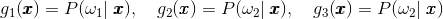
	
		g_1(\pmb x) = P(\omega_1 | \; \pmb{x}), \quad  g_2(\pmb{x}) = P(\omega_2 | \; \pmb{x}), \quad  g_3(\pmb{x}) = P(\omega_2 | \; \pmb{x})

	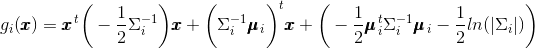

		\quad g_i(\pmb{x}) = \pmb{x}^{\,t} \bigg( - \frac{1}{2} \Sigma_i^{-1} \bigg) \pmb{x} + \bigg( \Sigma_i^{-1} \pmb{\mu}_{\,i}\bigg)^t \pmb x + \bigg( -\frac{1}{2} \pmb{\mu}_{\,i}^{\,t}  \Sigma_{i}^{-1} \pmb{\mu}_{\,i} -\frac{1}{2} ln(|\Sigma_i|)\bigg)

 
 

### Binomial distribution

- Probability density function:

	p_k = \bigg[ \begin{array}{c} n \\ k \end{array}\bigg] \cdot p^k \cdot (1-p)^{n-k}

 
 

### Co-Variance

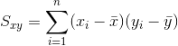

	S_{xy} = \sum_{i=1}^{n} (x_i - \bar{x})(y_i - \bar{y})\quad

example covariance matrix:

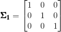

	\quad\pmb{\Sigma_1} = 
	\begin{bmatrix}1\quad 0\quad 0\\0\quad 1\quad0\\0\quad0\quad1\end{bmatrix}\quad

 
 

### Eigenvector and Eigenvalue

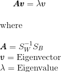

    \pmb A\pmb{v} =  \lambda\pmb{v}\\\\

    where \\\\

    \pmb A = S_{W}^{-1}S_B\\
    \pmb{v} = \; Eigenvector\\
    \lambda = \; Eigenvalue
    
   

 
 

### Least-squares fit regression

- Linear equation

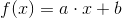

	f(x) = a\cdot x + b
	
Slope:

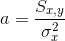

	a = \frac{S_{x,y}}{\sigma_{x}^{2}}\quad

Y-axis intercept:

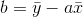

	b = \bar{y} - a\bar{x}\quad
	
where

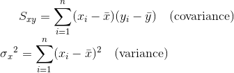

	S_{xy} = \sum_{i=1}^{n} (x_i - \bar{x})(y_i - \bar{y})\quad (covariance) \\
	\sigma{_x}^{2} = \sum_{i=1}^{n} (x_i - \bar{x})^2\quad (variance)	
	
 
 	
	
- Matrix equation

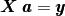

	\pmb X \; \pmb a = \pmb y
	

	\pmb X \; \pmb a = \pmb y

    \Bigg[ \begin{array}{cc}
    x_1 & 1  \\
    ... & 1 \\
    x_n & 1  \end{array} \Bigg]$
    $\bigg[ \begin{array}{c}
    a  \\
    b \end{array} \bigg]$
    $=\Bigg[ \begin{array}{c}
    y_1   \\
    ...  \\
    y_n  \end{array} \Bigg]

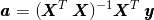

	\pmb a = (\pmb X^T \; \pmb X)^{-1} \pmb X^T \; \pmb y

 
 

### Linear Discriminant Analysis

- In-between class scatter matrix

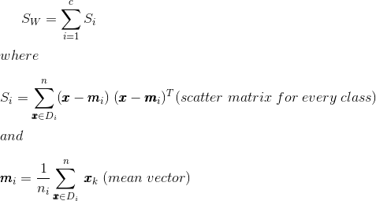

    S_W = \sum\limits_{i=1}^{c} S_i \\\\

    where  \\\\

    S_i = \sum\limits_{\pmb x \in D_i}^n (\pmb x - \pmb m_i)\;(\pmb x - \pmb m_i)^T
    (scatter \; matrix \; for \; every \; class) \\\\

    and \\\\
      
    \pmb m_i = \frac{1}{n_i} \sum\limits_{\pmb x \in D_i}^n \; \pmb x_k \;(mean \; vector)m	\limits_{\pmb x \in D_i}^n \; \pmb x_k \;(mean \; vector)

 
 

- Between class scatter matrix

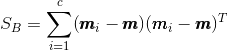
	
	S_B = \sum\limits_{i=1}^{c} (\pmb m_i - \pmb m) (\pmb m_i - \pmb m)^T

 
 

### Maximum Likelihood Estimate

The probability of observing the data set 

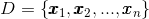

	D = \left\{ \pmb x_1, \pmb x_2,..., \pmb x_n \right\} 
	
 can be pictured as probability to observe a particular sequence of patterns,  
where the probability of observing a particular patterns depends on **&theta;**, the parameters the underlying (class-conditional) distribution. In order to apply MLE, we have to make the assumption that the samples are *i.i.d.* (independent and identically distributed).

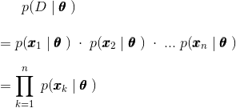

    p(D\; | \;  \pmb \theta\;) \\\\
    = p(\pmb x_1 \; | \; \pmb \theta\;)\; \cdot \; p(\pmb x_2 \; | \;\pmb \theta\;) \; \cdot \;...  \; p(\pmb x_n \; | \; \pmb \theta\;) \\\\
    = \prod_{k=1}^{n} \; p(\pmb x_k \pmb \; | \; \pmb \theta \;)

Where **&theta;** is the parameter vector, that contains the parameters for a particular distribution that we want to estimate.

and p(D | **&theta;**) is also called the likelihood of **&theta;**.

- log-likelihood
 
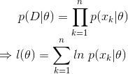

	p(D|\theta) = \prod_{k=1}^{n} p(x_k|\theta) \\
	\Rightarrow l(\theta) = \sum_{k=1}^{n} ln \; p(x_k|\theta)

- Differentiation

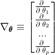

    \nabla_{\pmb \theta} \equiv \begin{bmatrix}  
    \frac{\partial \; }{\partial \; \theta_1} \\
    \frac{\partial \; }{\partial \; \theta_2} \\
    ...\\
    \frac{\partial \; }{\partial \; \theta_p}\end{bmatrix}

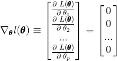

    \nabla_{\pmb \theta} l(\pmb\theta) \equiv \begin{bmatrix}  
    \frac{\partial \; L(\pmb\theta)}{\partial \; \theta_1} \\
    \frac{\partial \; L(\pmb\theta)}{\partial \; \theta_2} \\
    ...\\
    \frac{\partial \; L(\pmb\theta)}{\partial \; \theta_p}\end{bmatrix}$
    $= \begin{bmatrix}  
    0 \\
    0 \\
    ...\\
    0\end{bmatrix}

- parameter vector

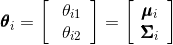

    \pmb \theta_i = \bigg[ \begin{array}{c}
    \ \theta_{i1} \\
    \ \theta_{i2} \\
    \end{array} \bigg]=
    \bigg[ \begin{array}{c}
    \pmb \mu_i \\
    \pmb \Sigma_i \\
    \end{array} \bigg]

 
 

### Min-Max scaling

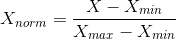

	X_{norm} = \frac{X - X_{min}}{X_{max}-X_{min}}

 
 

### Normal distribution (multivariate)

- Probability density function

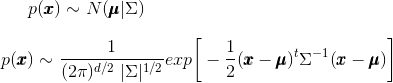

	p(\pmb x) \sim N(\pmb \mu|\Sigma)\\\\

	p(\pmb x) \sim \frac{1}{(2\pi)^{d/2} \; |\Sigma|^{1/2}} exp \bigg[ -\frac{1}{2}(\pmb x - \pmb \mu)^t \Sigma^{-1}(\pmb x - \pmb \mu) \bigg]

 
 

### Normal distribution (univariate)

- Probability density function

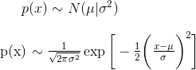

	p(x) \sim N(\mu|\sigma^2) \\\\

	p(x) \sim \frac{1}{\sqrt{2\pi\sigma^2}} \exp{ \bigg[-\frac{1}{2}\bigg( \frac{x-\mu}{\sigma}\bigg)^2 \bigg] } $

 
 

### Parzen window function

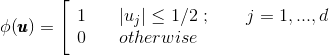

	\phi(\pmb u) = \Bigg[ \begin{array}{ll} 1 & \quad |u_j| \leq 1/2 \; ;\quad \quad j = 1, ..., d \\
	0 & \quad otherwise \end{array} 

for a hypercube of unit length 1 centered at the coordinate system's origin. What this function basically does is assigning a value 1 to a sample point if it lies within 1/2 of the edges of the hypercube, and 0 if lies outside (note that the evaluation is done for all dimensions of the sample point).

If we extend on this concept, we can define a more general equation that applies to hypercubes of any length *hn* that are centered at ***x***: 

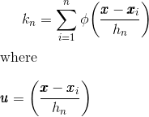

	k_n = \sum\limits_{i=1}^{n} \phi \bigg( \frac{\pmb x - \pmb x_i}{h_n} \bigg)\\\\

	where \; \pmb u = \bigg( \frac{\pmb x - \pmb x_i}{h_n} \bigg)

- probability density estimation with hypercube kernel

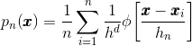

	p_n(\pmb x) = \frac{1}{n} \sum\limits_{i=1}^{n} \frac{1}{h^d} \phi \bigg[ \frac{\pmb x - \pmb x_i}{h_n} \bigg]

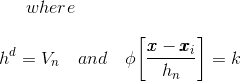

	where\\\\   
	h^d = V_n\quad   and    \quad\phi \bigg[ \frac{\pmb x - \pmb x_i}{h_n} \bigg] = k

- probability density estimation with Gaussian kernel

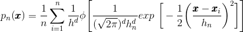

	p_n(\pmb x) = \frac{1}{n} \sum\limits_{i=1}^{n} \frac{1}{h^d} \phi \Bigg[ \frac{1}{(\sqrt {2 \pi})^d h_{n}^{d}} exp \; \bigg[ -\frac{1}{2} \bigg(\frac{\pmb x - \pmb x_i}{h_n} \bigg)^2 \bigg] \Bigg]

 
 

### Population mean

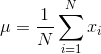

	\mu = \frac{1}{N} \sum_{i=1}^N x_i

example mean vector:

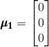

	\pmb{\mu_1} = 
	\begin{bmatrix}0\\0\\0\end{bmatrix}

 
 

### Poisson distribution (univariate)

- Probability density function

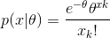

	p(x|\theta) = \frac{e^{-\theta}\theta^{xk}}{x_k!}

 
 

### Principal Component Analysis

- Scatter matrix

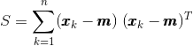

	S = \sum\limits_{k=1}^n (\pmb x_k - \pmb m)\;(\pmb x_k - \pmb m)^T
	
	
where 

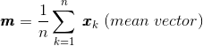

	\pmb m = \frac{1}{n} \sum\limits_{k=1}^n \; \pmb x_k \; (mean \; vector)

 
 

### Rayleigh distribution (univariate)

- Probability density function

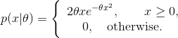

    p(x|\theta) =  \Bigg\{ \begin{array}{c}
      2\theta xe^{- \theta x^2},\quad \quad x \geq0, \\
      0,\quad otherwise. \\
      \end{array}

 
 

### Standard deviation

	\sigma = \sqrt{\frac{1}{N} \sum_{i=1}^N (x_i - \mu)^2}
	
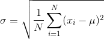

 
 

### Variance

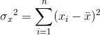

	\sigma{_x}^{2} = \sum_{i=1}^{n} (x_i - \bar{x})^2\quad

 
 

### Z-score

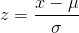

 	z = \frac{x - \mu}{\sigma}
 	
 
 

